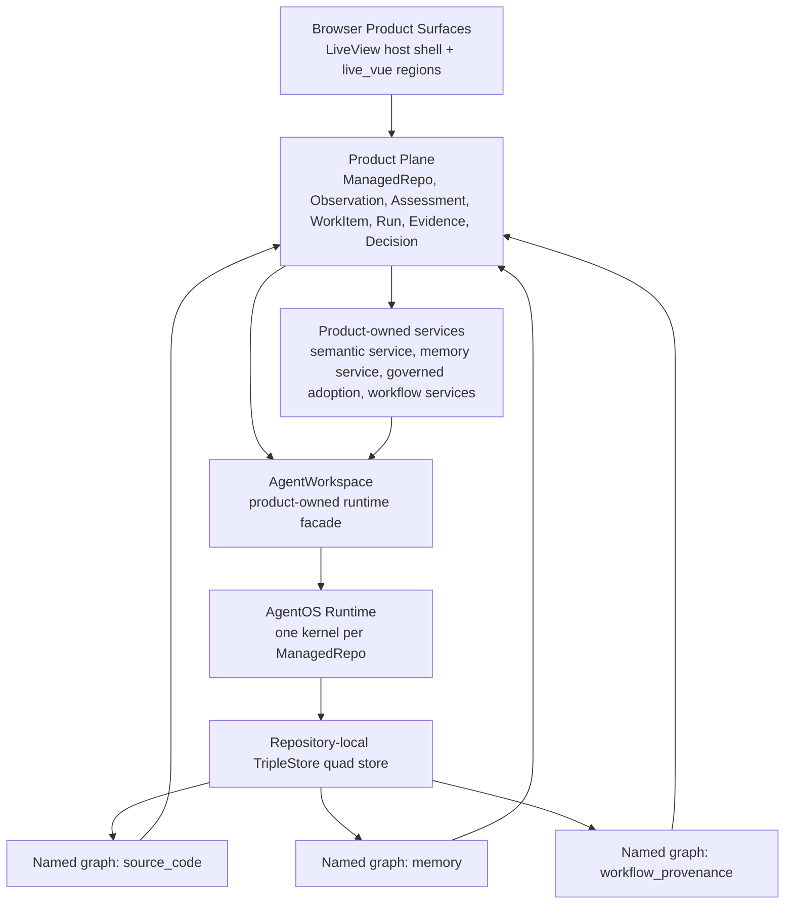
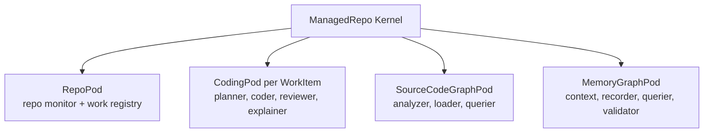
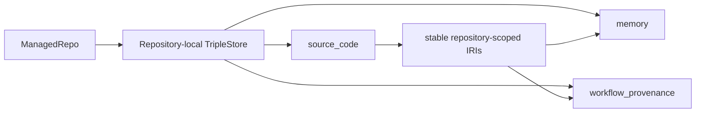
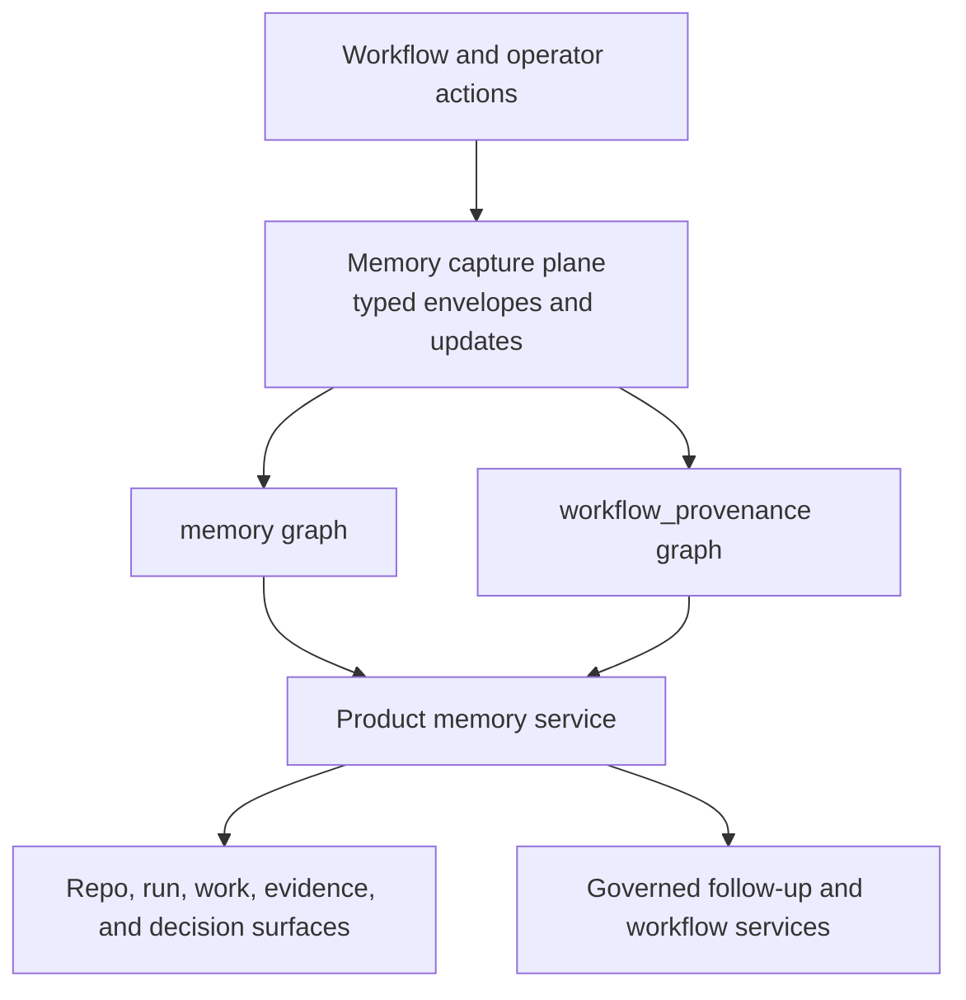
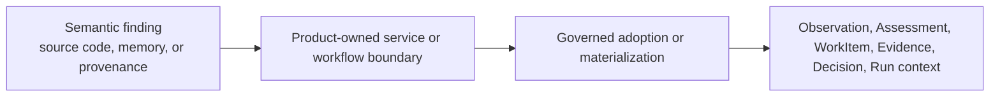

# Jido.Code Topology

This document explains the current architecture topology for `jido_code` at a
high level. It complements the current-truth subject specs and ADRs by showing
how the main product, runtime, semantic, and governance concepts fit together.

## Top-Level Topology

At the highest level, `jido_code` has four cooperating layers:

1. the browser and product shell
2. the durable product and governance control plane
3. the repository-scoped AgentOS runtime
4. the repository-local semantic store and linked named graphs

The key idea is that the product plane remains the durable system of record.
The runtime and semantic layers help the product reason and act, but they do
not replace governed product records.

## Core Concepts

### Browser Product Surfaces

The browser layer uses Phoenix LiveView as the routed host shell and `live_vue`
as the bounded rich-component bridge where richer exploration is helpful.

Key concepts:

- `ProjectDetailLive`, `WorkbenchLive`, `RunDetailLive`, and related LiveViews
  own routes, authentication, and server-authored state.
- Vue regions are mounted through product-owned boundaries instead of direct
  ad hoc client islands.
- Operator surfaces stay product-owned even when they explore semantic or memory
  history.

### Product Plane

The product plane is the governed software-factory control plane.

Key concepts:

- `SourceRepo`: external source-control identity.
- `ManagedRepo`: canonical repository record for product supervision.
- `Observation`, `Assessment`, and `WorkItem`: governed demand and work
  synthesis records.
- `Run`, `Evidence`, and `Decision`: governed execution and review records.
- product-owned services: semantic service, memory service, workflow service,
  governed adoption, and related shaping boundaries.

This layer decides what matters to the product. Semantic or runtime findings
must re-enter this layer before they become durable factory truth.

### AgentWorkspace

`AgentWorkspace` is the product-owned facade over the repository runtime.

Its job is to hide kernel and pod topology from UI and service code while
providing stable repository-scoped entrypoints for:

- coding workflows
- source-code graph preparation and query
- memory and workflow-provenance capture
- memory validation, invalidation, refresh, and recovery

It is the seam between the durable product plane and the runtime plane.

## Repository-Scoped Runtime Topology

Each managed repository gets one AgentOS kernel. That kernel hosts the pods that
provide repository runtime behavior.

### RepoPod

The repository singleton pod for monitoring and repository-scoped runtime
support.

### CodingPod

One coding pod per work item. It hosts collaborating specialists like planner,
coder, reviewer, and explainer, along with collaboration state such as project
context and task-board updates.

### SourceCodeGraphPod

The semantic-analysis pod that uses `ElixirOntologies` plus `TripleStore` to
analyze the repository in full mode and load the canonical `source_code` graph.

### MemoryGraphPod

The semantic-memory pod that records workflow provenance and durable coding
memory, supports freshness and invalidation behavior, and backs product-facing
memory services.

## Semantic Store Topology

The semantic store is repository-local. Each repository keeps its own quad
store and its own named graphs.

### `source_code`

This graph stores ontology-backed code structure for the repository. It is the
semantic map of modules, functions, files, runtime patterns, and related source
entities.

### `memory`

This graph stores durable coding memory such as:

- `Fact`
- `Decision`
- `LessonLearned`
- `Invariant`
- `Convention`
- `KnownIssue`
- `OpenQuestion`
- `Pattern`
- `AntiPattern`

These memories are durable only after explicit classification or adoption.

### `workflow_provenance`

This graph stores workflow and runtime provenance such as:

- `WorkSession`
- `AgentRun`
- `ToolInvocation`
- `PromptTurn`
- `Plan`
- `Patch`
- `Review`

This graph explains how work happened and how later memories or governed
follow-up were produced.

## Memory And Provenance Topology

The memory system has two related but separate concerns:

- capture: how provenance and memory individuals get written
- product adoption: how those records are retrieved, shaped, and acted on

### Memory Capture Plane

The capture plane is the canonical write seam. Product and runtime callers emit
typed envelopes rather than raw triples.

It handles:

- workflow provenance capture
- durable memory insertion
- durable memory validation, invalidation, and supersession updates

### Product Memory Services

These are product-owned boundaries that retrieve and shape memory for operator
surfaces and workflows. They hide raw graph internals and expose:

- bounded memory and provenance projections
- freshness, validation, invalidation, and recovery state
- cross-graph navigation
- governed follow-up inputs

## Cross-Graph Navigation

Cross-graph navigation is how the product safely moves among:

- code anchors in `source_code`
- durable memories in `memory`
- workflow provenance in `workflow_provenance`
- governed product records such as runs, work items, evidence, and decisions

The product does not expose raw graph joins or direct RDF query text as the UI
contract. Instead, it exposes repository-scoped routes and bounded projections.

## Governed Re-Entry

One of the most important topology rules is that semantic findings do not become
product truth by themselves.

This is what keeps the product architecture coherent:

- semantic layers support understanding, review, recall, and follow-up
- governed records remain the canonical business truth
- operators can understand where a decision came from without the graph becoming
  a second control plane

## Current Architectural Reading

Today the architecture can be summarized like this:

- LiveView and `live_vue` own the browser product shell.
- The control plane owns durable repository, work, run, evidence, and decision
  truth.
- `AgentWorkspace` is the anti-corruption layer over the runtime.
- AgentOS provides one kernel per managed repository with bounded pods for repo
  work, coding work, source-code graph behavior, and memory behavior.
- `TripleStore` provides one repository-local semantic store with three linked
  named graphs: `source_code`, `memory`, and `workflow_provenance`.
- Semantic and memory findings help the factory, but they only affect product
  truth after governed re-entry.
