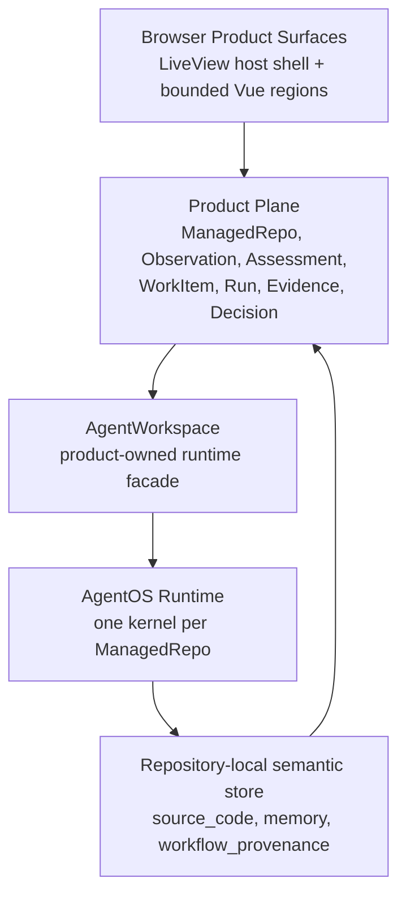
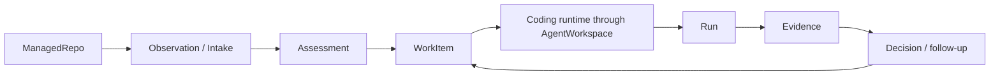

# 01. System Overview

This guide explains the top-level architecture of `jido_code`.

Current truth for the architecture still lives in:

- [`../../.spec/topology.md`](../../.spec/topology.md)
- [`../../.spec/specs/factory_control_plane.spec.md`](../../.spec/specs/factory_control_plane.spec.md)
- [`../../.spec/specs/agent_os_integration.spec.md`](../../.spec/specs/agent_os_integration.spec.md)

## The Short Version

`jido_code` is a governed software-factory control plane for Git-backed
repositories. The application is not primarily a chat app, a graph browser, or
an autonomous runtime on its own. It is a product plane that owns durable work,
governance, and operator-facing surfaces.

The runtime, conversations, and semantic graphs exist to help the product
reason and act. They do not replace product truth.

## Layered Model

## The Four Main Layers

### 1. Browser Product Surfaces

This is the Phoenix LiveView application plus bounded `live_vue` regions.

The browser layer owns:

- routes
- auth and session boundaries
- product-shaped page composition
- operator-facing views over repos, work, runs, conversations, and semantic
  context

### 2. Product Plane

This is the durable control plane. It owns canonical records such as:

- `SourceRepo`
- `ManagedRepo`
- `Observation`
- `Assessment`
- `WorkItem`
- `Run`
- `Evidence`
- `Decision`

If something matters to the factory, it needs to re-enter this layer.

### 3. Repository-Scoped Runtime

This is the AgentOS layer behind `AgentWorkspace`.

It owns:

- one kernel per managed repository
- one `RepoPod` singleton per kernel
- one `CodingPod` per work item
- optional repository-scoped semantic pods such as `SourceCodeGraphPod` and
  `MemoryGraphPod`

### 4. Repository-Local Semantic Store

This stores bounded semantic support data for a repository:

- `source_code`
- `memory`
- `workflow_provenance`

This store is repository-local runtime state, not the product system of record.

## Canonical Idea: Runtime And Graphs Inform The Product

The architecture keeps a strong truth boundary:

- runtime findings are not automatically product truth
- graph findings are not automatically product truth
- prompt text is not automatically durable memory
- tool output is not automatically durable evidence

Those things become durable only when a product-owned path adopts or records
them through governed records.

## End-To-End Control Loop

This loop is why the repo is described as a software factory control plane.

## What Contributors Should Keep In Mind

- `ManagedRepo` is the main repository concept inside the product.
- `AgentWorkspace` is the main product-owned seam into runtime behavior.
- `CodingPod` is scoped to a single work item, not the whole repo.
- semantic graphs and memory graphs are bounded enhancements, not hidden
  dependencies
- LiveView remains the host shell for routed surfaces

## Read Next

Continue with
[`02-product-plane-and-governed-records.md`](02-product-plane-and-governed-records.md).

