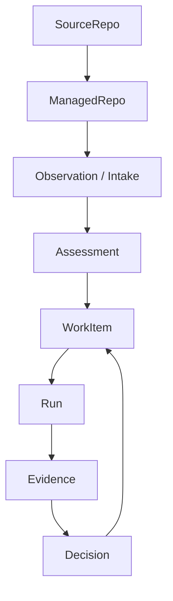

# 02. Product Plane And Governed Records

This guide explains the canonical product objects and why they matter more than
runtime internals.

Useful implementation sources:

- [`../../lib/jido_code/control/`](https://github.com/mikehostetler/jido_code/tree/main/lib/jido_code/control)
- [`../../lib/jido_code/operations/`](https://github.com/mikehostetler/jido_code/tree/main/lib/jido_code/operations)
- [`../../lib/jido_code/governance/`](https://github.com/mikehostetler/jido_code/tree/main/lib/jido_code/governance)

## Why The Product Plane Exists

`jido_code` is trying to supervise repository work in a governed way. That means
the product needs stable records for:

- what the repo is
- what was observed
- what work was created
- what happened during execution
- what evidence and decisions came out of it

The runtime can act, but the product plane decides what counts.

## Canonical Record Families

| Record | Purpose |
| --- | --- |
| `SourceRepo` | External repository identity such as the upstream Git or provider record |
| `ManagedRepo` | Internal managed wrapper that the product supervises |
| `Observation` | A normalized observation about repository state or demand |
| `Assessment` | Analysis or evaluation of observations |
| `WorkItem` | Durable unit of work the factory can plan, execute, review, or explain |
| `Run` | Execution record for a governed workflow or operation |
| `Evidence` | Supporting output, artifacts, or findings attached to a run or decision |
| `Decision` | Durable governance outcome or follow-up judgment |

## SourceRepo vs ManagedRepo

This distinction matters a lot.

- `SourceRepo` answers: what external repo identity are we connected to?
- `ManagedRepo` answers: what repository is the product supervising as a factory
  object?

The product uses `ManagedRepo` as the main route and supervision identity.

## Control Loop

## Why Runtime Results Must Rejoin Product Records

The repo has rich runtime and semantic subsystems:

- AgentOS pods
- semantic graph queries
- workflow provenance capture
- memory graph findings
- conversations and prompt history

Those are useful, but the product still requires a governed result to make them
matter durably. For example:

- a semantic finding should become an `Observation`, `Assessment`, `WorkItem`,
  `Evidence`, or `Decision`
- a runtime action should become a `Run` plus governed outcomes
- a conversation should steer or synthesize work rather than becoming a second
  hidden task system

## Truth Boundaries

When working on the repo, keep these boundaries explicit:

- product truth lives in Ash-backed governed records
- runtime state is operational state
- graph state is semantic support state
- prompt and tool traffic are inputs to the system, not automatically durable
  memory or evidence

## What This Means For Feature Work

When you add a feature, ask:

1. What is the canonical product record here?
2. Is this a runtime detail or a durable outcome?
3. If the user cares about it later, which governed surface should it rejoin?

That framing usually leads to the right boundary.

## Read Next

Continue with
[`03-agent-workspace-and-runtime-topology.md`](https://github.com/mikehostetler/jido_code/blob/main/docs/developer/03-agent-workspace-and-runtime-topology.md).
