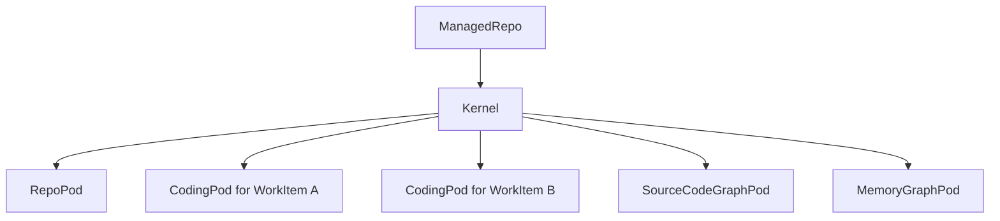

# 03. AgentWorkspace And Runtime Topology

This guide explains the repository-scoped runtime and the role of
`AgentWorkspace`.

Current truth for this area lives in:

- [`../../.spec/specs/agent_os_integration.spec.md`](https://github.com/mikehostetler/jido_code/blob/main/.spec/specs/agent_os_integration.spec.md)
- [`../../.spec/topology.md`](https://github.com/mikehostetler/jido_code/blob/main/.spec/topology.md)
- [`../../lib/jido_code/agent_workspace.ex`](https://github.com/mikehostetler/jido_code/blob/main/lib/jido_code/agent_workspace.ex)

## What AgentWorkspace Is

`AgentWorkspace` is the product-owned facade over the AgentOS runtime.

Its job is to hide kernels, pods, and internal routing from:

- LiveViews
- product services
- controller-like entrypoints

The product should ask `AgentWorkspace` for work, graph, memory, and
conversation operations rather than reaching into pods directly.

## Scope

`AgentWorkspace` is repository-scoped first.

- one `AgentWorkspace` facade conceptually fronts one managed repository runtime
- one kernel exists per `ManagedRepo`
- work-item-specific behavior lives inside work-item-specific pods within that
  kernel

That means the runtime hierarchy is:



## Pod Types

### RepoPod

Repository singleton for repo-scoped runtime support such as monitoring and work
registry behavior.

### CodingPod

One per work item. This is where planning, coding, review, explanation, and
task-board coordination happen.

### SourceCodeGraphPod

Repository-scoped semantic source-code graph support.

### MemoryGraphPod

Repository-scoped memory and workflow-provenance support.

## Public Runtime Boundary

`AgentWorkspace` exposes product-facing functions such as:

- kernel preparation
- coding work entrypoints
- source-code graph preparation and query
- memory graph recording and query
- conversation entrypoints

For coding, the main shape is:

```text
managed_repo_id + work_item_id + instruction + opts
```

That is the key clue about the architecture:

- repo scope chooses the kernel
- work-item scope chooses the coding pod
- instruction and opts shape the specialist run

## Naming And Identity

The runtime follows stable naming conventions:

- one kernel per repo, named from the managed repo id
- `repo-pod` as the repo singleton
- `coding-pod-{work_item_id}` for work-item pods

Those names matter for persistence and restoration, but they are intentionally
hidden behind `AgentWorkspace`.

## Runtime Persistence And Recovery

The runtime is not purely in-memory.

Kernel snapshots and pod metadata let the system:

- restore resumable coding pods after restart
- detect missing runtime and rebuild from persisted state
- keep a repository-scoped view of active work items

This is part of why the public surface is `AgentWorkspace` rather than direct
pod process ids.

## Bounded Admission

`AgentWorkspace` also owns admission rules such as:

- work-queue limits per repository
- allowing resumable work items back into runtime
- refusing new work with typed `:work_queue_full` outcomes when capacity is
  exhausted

That is product policy, not a specialist concern.

## Key Contributor Rule

If you are adding product behavior, prefer extending `AgentWorkspace` or a
product-owned service over:

- calling a pod directly from UI code
- storing pod ids in product state
- letting browser code learn runtime topology

## Read Next

Continue with
[`04-coding-pod-and-specialist-workflows.md`](https://github.com/mikehostetler/jido_code/blob/main/docs/developer/04-coding-pod-and-specialist-workflows.md).

