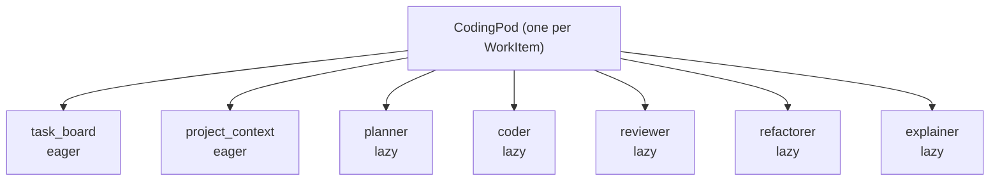
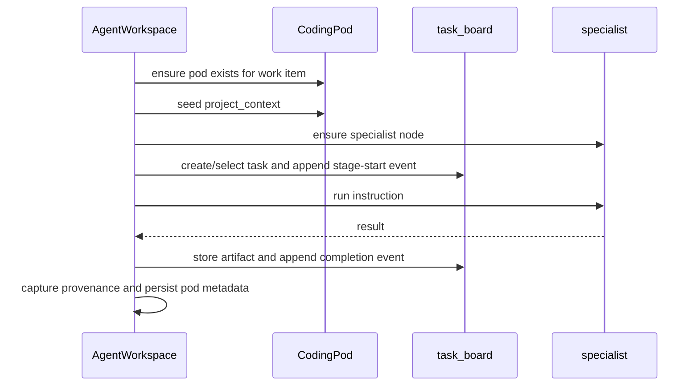

# 04. CodingPod And Specialist Workflows

This guide explains the per-work-item `CodingPod` and the lifecycle of its
specialist work.

Useful implementation sources:

- [`../../lib/jido_code/pods/coding_pod.ex`](https://github.com/mikehostetler/jido_code/blob/main/lib/jido_code/pods/coding_pod.ex)
- [`../../lib/jido_code/agent_workspace.ex`](https://github.com/mikehostetler/jido_code/blob/main/lib/jido_code/agent_workspace.ex)

## Scope

There is one `CodingPod` per `WorkItem`.

That is the isolation boundary for coding work:

- work item A gets one pod
- work item B gets a different pod
- both can run in the same repo kernel in parallel

## Pod Topology

## Eager Agents

### `task_board`

The task board tracks shared workflow state for the work item:

- tasks
- active task id
- activity log
- stored artifacts
- stage progress

It is the collaboration substrate for specialist stages.

### `project_context`

The project context holds pod-local repository bindings such as:

- `workspace_path`
- `work_item_id`
- `project_metadata`

It is explicitly seeded by `AgentWorkspace` when the runtime pod is created or
restored.

## Lazy Specialists

The AI specialists only start when needed:

- `planner`
- `coder`
- `reviewer`
- `refactorer`
- `explainer`

This keeps the pod lightweight until a stage needs a specialist node.

## Lifecycle

The usual work lifecycle looks like this:

## What `run_specialist` Adds

The workspace does more than call the specialist.

It wraps each run with:

- task-board stage tracking
- artifact storage
- success or failure events
- workflow provenance capture
- pod metadata persistence such as `last_plan`, `last_changes`,
  `last_review`, and `last_explanation`

## Important Nuance: Specialist Context Is Per Specialist

Inside one work item pod:

- the `planner` keeps its own AI context
- the `coder` keeps its own AI context
- the `reviewer` keeps its own AI context

Those contexts are not one shared conversation thread.

That means the work item pod is shared, but the LLM turn history is specialist
local.

## Full Workflow

`full_workflow` currently coordinates:

1. planning
2. coding
3. review

It is sequential orchestration through the workspace.

One subtle but important point: the implementation does not automatically
forward the planner's output as a new prompt into the coder and reviewer.
Instead, each stage gets the requested instruction and the current repo state,
plus any explicit semantic or memory context passed in through options.

## Refactorer Nuance

The pod topology includes a `refactorer`, but the main public workspace API
does not currently expose a dedicated `refactor_work/...` entrypoint. The node
exists in the pod contract even though it is not surfaced like plan, execute,
review, and explain.

## Pod Teardown

When work is completed:

- the runtime pod is shut down
- metadata is marked `:completed`
- specialist histories for that work item stop persisting in memory

So the work-item boundary is also the practical lifetime boundary.

## Read Next

Continue with
[`05-specialist-prompts-context-and-tool-execution.md`](https://github.com/mikehostetler/jido_code/blob/main/docs/developer/05-specialist-prompts-context-and-tool-execution.md).

