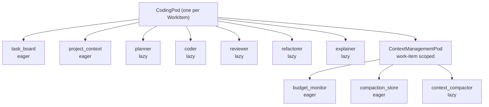
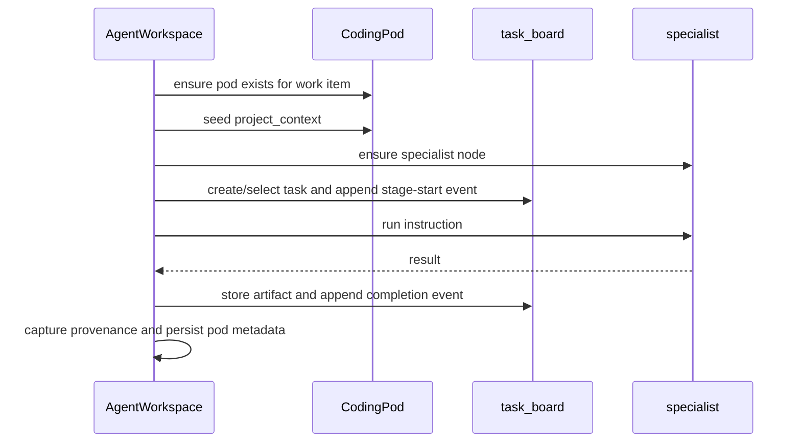

# 04. CodingPod And Specialist Workflows

This guide explains the per-work-item `CodingPod` and the lifecycle of its
specialist work.

Useful implementation sources:

- [`../../lib/jido_code/pods/coding_pod.ex`](https://github.com/mikehostetler/jido_code/blob/main/lib/jido_code/pods/coding_pod.ex)
- [`../../lib/jido_code/pods/context_management_pod.ex`](https://github.com/mikehostetler/jido_code/blob/main/lib/jido_code/pods/context_management_pod.ex)
- [`../../lib/jido_code/agent_workspace.ex`](https://github.com/mikehostetler/jido_code/blob/main/lib/jido_code/agent_workspace.ex)

## Scope

There is one `CodingPod` per `WorkItem`.

That is the isolation boundary for coding work:

- work item A gets one pod
- work item B gets a different pod
- both can run in the same repo kernel in parallel

## Pod Topology

## Eager Agents

### `task_board`

The task board tracks shared workflow state for the work item:

- tasks
- active task id
- activity log
- stored artifacts
- stage progress

It is the collaboration substrate for specialist stages.

### `project_context`

The project context holds pod-local repository bindings such as:

- `workspace_path`
- `work_item_id`
- `project_metadata`

It is explicitly seeded by `AgentWorkspace` when the runtime pod is created or
restored.

## Context Management Pod

Each work-item `CodingPod` owns one `ContextManagementPod`. It is not
repository-scoped because specialist history is specialist-local and
work-item-local.

The context-management pod contains:

- `budget_monitor`, an eager metadata-only observer for context-budget
  diagnostics
- `compaction_store`, an eager deterministic store for accepted summaries
- `context_compactor`, a lazy bounded compaction boundary

The pod can recommend or perform proactive compaction, but it does not replace
request-time `ContextBudget` packing. Disabled, degraded, or failed context
management falls back to the existing provider-request budget guard.

Automatic compaction follows the conversation lifecycle. Budget observations
produce monitor decisions; matching recommendations become pending
conversation state; the coordinator executes them only at a terminal boundary.
Accepted attempts store a bounded summary and append
`conversation.context_compacted`, which resets prompt-facing shared context for
the covered old spans without deleting the event history. Failed attempts append
`conversation.context_compaction_failed` and keep execution moving.

The public controls live on `AgentWorkspace`:

- `record_context_observation/4` records metadata-only budget observations
- `auto_compact_context/4` executes an eligible monitor recommendation
- `retry_auto_compact_context/4` retries the latest eligible recommendation,
  including matching debounced recommendations
- `disable_auto_compaction/3` stops automatic execution while preserving
  monitor observations and recommendations

Operator metadata exposes lifecycle states such as `recommended`, `pending`,
`deferred`, `compacted`, `skipped`, and `degraded`. It should include ids,
counts, reset references, and remediation hints, not raw old prompts or tool
output.

## Lazy Specialists

The AI specialists only start when needed:

- `planner`
- `coder`
- `reviewer`
- `refactorer`
- `explainer`

This keeps the pod lightweight until a stage needs a specialist node.

## Lifecycle

The usual work lifecycle looks like this:

## What `run_specialist` Adds

The workspace does more than call the specialist.

It wraps each run with:

- task-board stage tracking
- artifact storage
- success or failure events
- workflow provenance capture
- pod metadata persistence such as `last_plan`, `last_changes`,
  `last_review`, `last_refactor`, and `last_explanation`

## Important Nuance: Specialist Context Is Per Specialist

Inside one work item pod:

- the `planner` keeps its own AI context
- the `coder` keeps its own AI context
- the `reviewer` keeps its own AI context

Those contexts are not one shared conversation thread.

That means the work item pod is shared, but the LLM turn history is specialist
local.

## Full Workflow

`full_workflow` currently coordinates:

1. planning
2. coding
3. review

It is sequential orchestration through the workspace.

One subtle but important point: the implementation does not automatically
forward the planner's output as a new prompt into the coder and reviewer.
Instead, each stage gets the requested instruction and the current repo state,
plus any explicit semantic or memory context passed in through options.

## Refactorer API

The pod topology includes a lazy `refactorer`, exposed through
`AgentWorkspace.refactor_work/3,4`.

Use the workspace entrypoint rather than direct pod or specialist calls. It:

- routes through the existing per-work-item `CodingPod`
- lazily ensures the `refactorer` node
- preserves the shared specialist wrapper for task-board state, artifacts,
  workflow provenance, semantic context, memory context, and pod metadata

`full_workflow/3,4` still remains plan -> code -> review. Refactoring is an
explicit stage until a later phase changes default workflow orchestration.

Conversation routing now treats explicit behavior-preserving refactor intent as
the `:refactor` workflow and dispatches it through
`AgentWorkspace.refactor_work/3,4`. Generic fix, edit, update, and patch
requests still route to `:execute`; use refactor when the requested change is
structural cleanup, extraction, rename, deduplication, or simplification that
should preserve behavior.

Conversation and workflow surfaces should keep this as a product-owned
workspace route. They should not expose pod-local details such as node names,
process ids, or specialist internals when refactor startup degrades.

## Pod Teardown

When work is completed:

- the runtime pod is shut down
- the context-management pod for the work item is shut down
- metadata is marked `:completed`
- specialist histories for that work item stop persisting in memory

So the work-item boundary is also the practical lifetime boundary.

## Read Next

Continue with
[`05-specialist-prompts-context-and-tool-execution.md`](https://github.com/mikehostetler/jido_code/blob/main/docs/developer/05-specialist-prompts-context-and-tool-execution.md).
