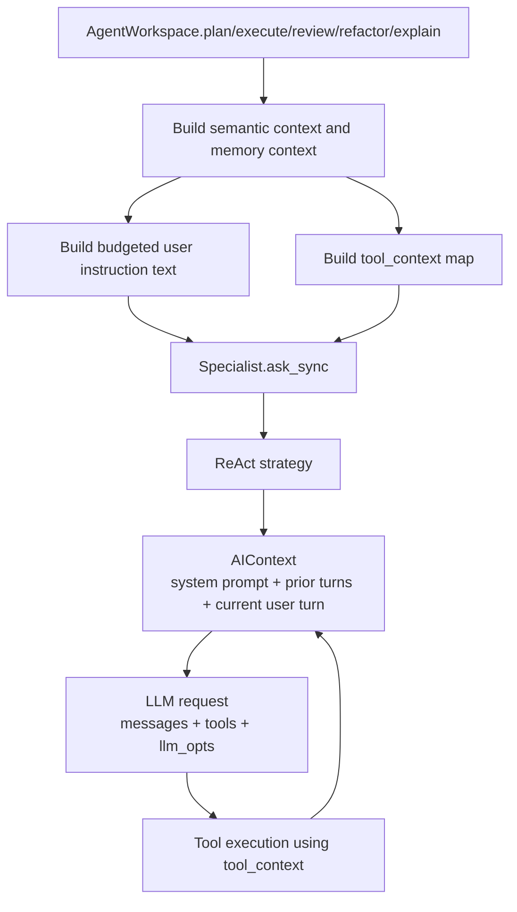

# 05. Specialist Prompts, Context, And Tool Execution

This guide explains how context is handled inside `CodingPod` specialists and
what actually reaches the LLM.

Useful implementation sources:

- [`../../lib/jido_code/agent_workspace.ex`](https://github.com/mikehostetler/jido_code/blob/main/lib/jido_code/agent_workspace.ex)
- [`../../lib/jido_code/agent_workspace/prompt_projection.ex`](https://github.com/mikehostetler/jido_code/blob/main/lib/jido_code/agent_workspace/prompt_projection.ex)
- [`../../lib/jido_code/context_budget.ex`](https://github.com/mikehostetler/jido_code/blob/main/lib/jido_code/context_budget.ex)
- [`../../lib/jido_code/agents/`](https://github.com/mikehostetler/jido_code/tree/main/lib/jido_code/agents)
- [`../../deps/jido_ai/lib/jido_ai/reasoning/react/strategy.ex`](https://github.com/agentjido/jido_ai/blob/5601aa5eec5341a3cd62c951c029e53cd584a110/lib/jido_ai/reasoning/react/strategy.ex)
- [`../../deps/jido_ai/lib/jido_ai/reasoning/react/runner.ex`](https://github.com/agentjido/jido_ai/blob/5601aa5eec5341a3cd62c951c029e53cd584a110/lib/jido_ai/reasoning/react/runner.ex)

## The Three Context Layers

There are three different kinds of context in play.

| Context kind | Owner | Lifetime | Reaches the LLM directly? |
| --- | --- | --- | --- |
| Pod collaboration state | `task_board`, `project_context` | lifetime of the work-item pod | No, not automatically |
| Specialist AI context | each AI specialist node | lifetime of that specialist node within the pod | Yes |
| Tool execution context | workspace-built `tool_context` map | one specialist request | Indirectly, through tools |

This distinction is the most important thing to keep straight.

## Big Picture Flow



## What The Workspace Adds Before Calling The Specialist

For `plan_work`, `execute_work`, `review_work`, `refactor_work`, and
`explain_work`, `AgentWorkspace` prepares three important inputs:

1. a user instruction string
2. a `tool_context` map
3. workflow provenance wrappers around the run

### 1. User Instruction Text

The workspace builds the actual user prompt text through the context budget
boundary. The raw operator instruction is a required section. Semantic and
memory graph context are optional prompt-facing projections, not raw graph maps.

If semantic or memory context exists, the workspace turns it into compact prompt
text like:

```text
Workflow: review
Instruction: Review the login implementation

Semantic context:
graph_ready?: true
graph_revision: ...
functions: ...

Memory context:
freshness: Memory graph ready
policy_intent: implementation_constraints
memory: Decision: ...
```

The packer may trim or drop optional projection lines when the context budget is
tight. It keeps diagnostics for original size, packed size, dropped entries,
and projection state without exposing raw prompt bodies as product metadata.

### 2. Tool Context Map

The workspace separately builds a `tool_context` map that can include:

- `managed_repo_id`
- `workspace_path`
- source-code graph readiness and revision info
- memory graph context
- context-budget diagnostics

This map is not automatically appended to the prompt. It is mainly for tools.
Keeping `tool_context` structured is what lets tools use graph state even when
the prompt-facing projection was trimmed.

### 3. Provenance Wrapping

The workspace also wraps the run with:

- work-session provenance
- prompt-turn capture
- specialist run capture
- artifact capture for plans, patches, and reviews

That matters for memory and workflow-provenance behavior, but it is not prompt
content by itself.

## What A Specialist Adds

Each AI specialist is declared with `use Jido.AI.Agent`, which means each
specialist contributes its own:

- system prompt
- tool list
- model selection
- iteration limit
- accumulated AI turn history

### Specialist Differences

| Specialist | Model | Main prompt focus | Typical tools |
| --- | --- | --- | --- |
| Planner | `:reasoning` | produce a grounded implementation plan | file reads, code search, git status, semantic discovery |
| Coder | `:fast` | implement correct code changes | read/write files, tests, git status, git diff |
| Reviewer | `:fast` | critique correctness and risk | reads, git diff, tests, semantic/runtime-pattern lookup |
| Refactorer | `:reasoning` | improve structure without changing behavior | reads, writes, diff, tests |
| Explainer | `:fast` | explain code and changes clearly | reads, search, semantic relationship lookup |

Each of those specialists has its own system prompt in its module definition.

## Do All Agents Inject Their Own System Prompt?

No.

Only the AI specialists do:

- `planner`
- `coder`
- `reviewer`
- `refactorer`
- `explainer`

The eager coordination agents do not:

- `task_board`
- `project_context`

Those two are plain `Jido.Agent`s, not `Jido.AI.Agent`s. They maintain state
and respond to signals, but they do not create LLM requests.

## What The ReAct Layer Does

When `ask_sync` is called:

1. ReAct receives the query and request-scoped `tool_context`.
2. It merges request `tool_context` with any base tool context configured on the
   agent.
3. It starts from the specialist's existing `AIContext`.
4. It appends the current user message.
5. It projects the `AIContext` into LLM messages.
6. It prepends the specialist system prompt as the `system` message.
7. It sends the message list plus the specialist tool list to the model.

The actual LLM request is built from:

- budgeted specialist instructions appended into `AIContext`
- `AIContext.to_messages(state.context)`
- the specialist's configured tool registry
- request-scoped `llm_opts`

## What The Model Sees Directly vs Indirectly

### Directly

The model directly sees:

- the specialist system prompt
- prior messages already stored in that specialist's AI context
- the current user instruction text
- tool results that get appended back into the conversation

### Indirectly

The model indirectly benefits from:

- `workspace_path`
- repo ids
- graph readiness
- memory graph metadata
- runtime state snapshot

Those do not become prompt text automatically. Tools can use them when
executing actions like `ReadFile`, `GitDiff`, or semantic graph helpers.

## How Tools Use Tool Context

Many workspace tools resolve inputs from `tool_context`. For example:

- file actions use `workspace_path`
- source-code graph support uses repo id, workspace path, and graph revision
- memory graph helpers use repo and graph context

So the path is:

```text
tool_context -> tool execution environment -> tool result -> appended tool result message
```

That is why tool context affects model behavior without necessarily being prompt
text.

## Shared Pod State vs Prompt State

The pod has eager collaboration state in `task_board` and `project_context`, but
that state is not automatically injected into every LLM call.

Today the real bridges are:

- the workspace explicitly seeding project bindings into `project_context`
- the workspace carrying `workspace_path` and related values into `tool_context`
- the workspace recording task-board artifacts and events around specialist runs
- the workspace packing semantic and memory prompt projections before each
  specialist request

So the pod has coordination state, but prompt injection is still mostly
workspace-authored rather than pod-state-derived.

## Persistence And Reuse Of Specialist Context

Each specialist keeps its own ReAct context across calls while its node stays
alive.

That means:

- same repo + same work item + same specialist -> context persists
- same repo + same work item + different specialist -> different context
- different work item -> different pod, so no shared specialist context

This is why it makes sense to say the retained context is work-item-scoped in
practice, but specialist-local inside that work item.

## Important Nuances

### `full_workflow` Is Not Prompt Chaining

The workspace does not automatically feed the planner's result text into the
coder and reviewer as a new explicit prompt. The stages are orchestrated
sequentially, but prompt chaining is not the main contract.

`full_workflow/3,4` remains plan -> code -> review. `refactor_work/3,4` is an
explicit workspace entrypoint, not a default stage in full workflow
orchestration.

Conversation runtime may route explicit behavior-preserving refactor requests
to `refactor_work/3,4`. That is specialist selection, not prompt rewriting:
the original operator request is still wrapped as bounded conversation context
before it reaches the Refactorer.

### Relatedness Is Not Semantic Today

If you send two unrelated prompts to the same specialist on the same work item,
the existing specialist context is still there. The system does not currently
decide whether a new request is "about the same subtask" and reset context on
its own.

### Context Ends With Pod Lifetime

When the work item completes and the pod is torn down, that specialist context
is no longer active in memory.

## Mental Model To Keep

Use this model when debugging or designing specialist behavior:

- workspace builds the request
- specialist defines the role
- ReAct owns the conversational thread
- tools consume runtime context
- task board and project context coordinate the work item around the run

## Read Next

Continue with
[`12-user-request-to-llm-message-path.md`](https://github.com/mikehostetler/jido_code/blob/main/docs/developer/12-user-request-to-llm-message-path.md)
for the exact transformation path from user text to final LLM messages, then
[`06-conversation-orchestration.md`](https://github.com/mikehostetler/jido_code/blob/main/docs/developer/06-conversation-orchestration.md).
