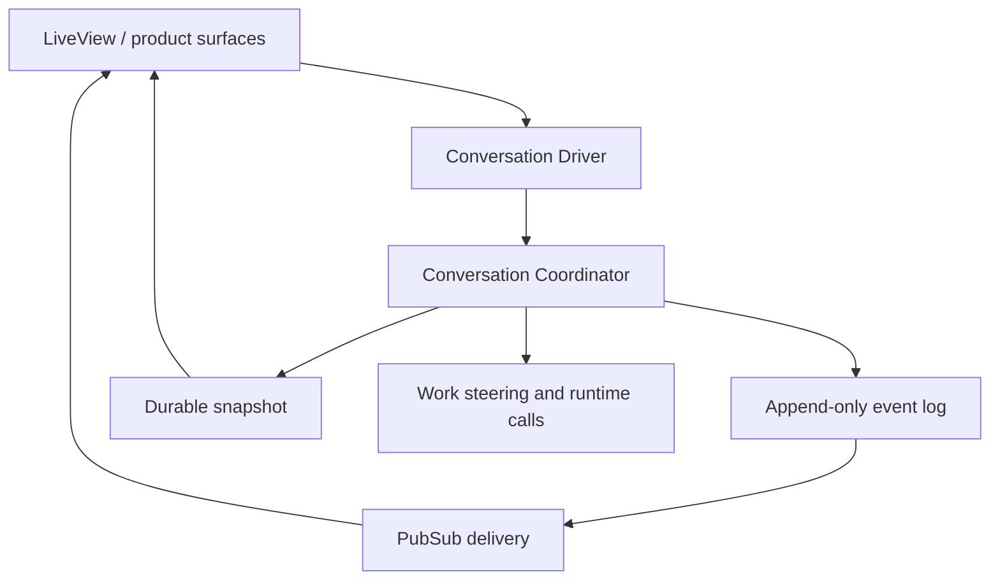

# 06. Conversation Orchestration

This guide explains how productive coding conversations are coordinated in
`jido_code`.

Current truth for this area lives in:

- [`../../.spec/specs/conversation_orchestration.spec.md`](../../.spec/specs/conversation_orchestration.spec.md)
- [`../../lib/jido_code/conversations/`](../../lib/jido_code/conversations/)
- [`../../lib/jido_code/agent_workspace.ex`](../../lib/jido_code/agent_workspace.ex)

## What A Conversation Is

A conversation is a managed-repository-scoped and usually work-item-scoped
productive session.

The important part is "productive":

- it can steer work
- it can synthesize or attach to a `WorkItem`
- it can emit durable events and snapshots
- it can be interrupted and resumed

It is not intended to be a free-floating page-local chat buffer.

## Core Components

| Component | Responsibility |
| --- | --- |
| `Conversations` | top-level product-facing API for reads and persistence lookups |
| `Driver` | product-owned runtime boundary for opening conversations and handling commands |
| `Coordinator` | active process that owns command admission, turn state, sequencing, and cancellation |
| `Command` | typed control and work commands |
| `Event` / `EventRecord` | append-only event stream and durable event persistence |
| `Snapshot` / `SnapshotRecord` | current restorable view for bootstrap, reconnect, and degraded mode |
| `PubSub` | event delivery to LiveView and adjacent surfaces |

## Architecture

## Command Model

The conversation layer distinguishes two command families:

- control commands
- work commands

Control commands include things like:

- stop
- steer
- pause
- resume
- tool cancel

Work commands are the ordinary "do the work" or "continue the task" requests.

This is a deliberate design choice. The system does not treat all user messages
as one FIFO queue.

## Why The Coordinator Exists

Each active conversation has a coordinator process because someone has to own:

- turn admission
- state transitions
- event ordering
- cancellation progress
- snapshots

That ownership makes interruption and reconnect behavior explainable.

## Event-Driven Delivery

Live updates are expected to flow through conversation events and PubSub.

Snapshots are for:

- cold load
- reconnect recovery
- degraded continuity

They are not meant to be the primary steady-state delivery mechanism.

## Relationship To Work Items

Conversations are repo-scoped first, but when they are doing durable factory
work they usually attach to one canonical `WorkItem`.

That means conversation state can preserve:

- active work item
- referenced files
- accepted tool results
- pending clarification

without inventing a second hidden work-management system outside the product
plane.

## Relationship To AgentWorkspace

The conversation layer should still go through product-owned boundaries rather
than leaking runtime topology into UI code.

In practice:

- UI talks to conversation APIs and event streams
- conversation runtime can steer or invoke product-owned work boundaries
- `AgentWorkspace` remains the runtime facade when actual coding work is needed

## Cancellation And Supersession

One of the most important parts of the design is explicit interruption.

The system aims to make these states visible:

- cancel requested
- cancellation acknowledged
- cancelled
- cancel failed

That makes long-running tool or turn interruption observable instead of feeling
like silent disappearance.

## What Contributors Should Optimize For

When touching conversation code, prefer:

- append-only sequenced events
- product-owned command types
- explicit degraded behavior
- repo and work-item scope

Avoid:

- page-local chat state as the main source of truth
- hidden runtime topology in LiveViews
- treating control commands as just another user message

## Read Next

Continue with
[`07-source-code-graph-and-semantic-services.md`](07-source-code-graph-and-semantic-services.md).

