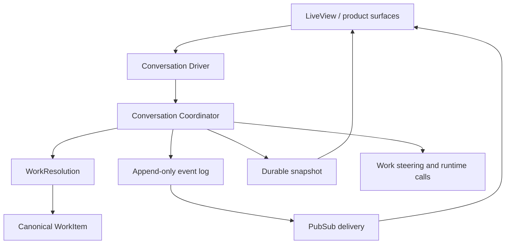
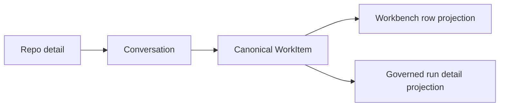

# 06. Conversation Orchestration

This guide explains how productive coding conversations are coordinated in
`jido_code`.

Useful implementation sources:

- [`../../lib/jido_code/conversations/`](https://github.com/mikehostetler/jido_code/tree/main/lib/jido_code/conversations)
- [`../../lib/jido_code/agent_workspace.ex`](https://github.com/mikehostetler/jido_code/blob/main/lib/jido_code/agent_workspace.ex)

## What A Conversation Is

A conversation is a managed-repository-hosted session with two distinct modes:

- bounded `repo_scoped` intake before durable work is admitted
- canonical `work_item_scoped` productive supervision once governed work exists

The important part is "productive":

- it can steer work
- it can synthesize or attach to a `WorkItem`
- it can emit durable events and snapshots
- it can be interrupted and resumed

It is not intended to be a free-floating page-local chat buffer.

## Core Components

| Component | Responsibility |
| --- | --- |
| `Conversations` | top-level product-facing API for reads and persistence lookups |
| `Driver` | product-owned runtime boundary for opening conversations and handling commands |
| `Coordinator` | active process that owns command admission, turn state, sequencing, and cancellation |
| `Conversations.ChildSupervisor` | application-owned dynamic supervisor for cancellable child-work processes |
| `ChildWorker` | runtime wrapper for one active unit of cancellable child work |
| `WorkResolution` | promotes productive repo conversation turns into canonical governed `WorkItem` scope before durable specialist execution continues |
| `Command` | typed control and work commands |
| `Event` / `EventRecord` | append-only event stream and durable event persistence |
| `Snapshot` / `SnapshotRecord` | current restorable view for bootstrap, reconnect, and degraded mode |
| `PubSub` | event delivery to LiveView and adjacent surfaces |

## Architecture



## Command Model

The conversation layer distinguishes two command families:

- control commands
- work commands

Control commands include things like:

- stop
- steer
- pause
- resume
- tool cancel

Work commands are the ordinary "do the work" or "continue the task" requests.

This is a deliberate design choice. The system does not treat all user messages
as one FIFO queue.

## Why The Coordinator Exists

Each active conversation has a coordinator process because someone has to own:

- turn admission
- state transitions
- event ordering
- cancellation progress
- snapshots

That ownership makes interruption and reconnect behavior explainable.

## Child Work Supervision

The coordinator owns conversation state. `Conversations.ChildSupervisor` owns
the normal OTP supervision path for cancellable child work. Tests and features
should treat it as shared application infrastructure, not as a per-test fixture
to stop or replace casually.

When the coordinator starts queued child work, it goes through `ChildWorker`
rather than calling the dynamic supervisor directly. That boundary normalizes
short supervisor shutdown windows and missing-supervisor failures into typed
start results. If supervised startup is temporarily unavailable, the child
worker may use a bounded coordinator-owned fallback so existing queued turn
semantics continue without crashing the coordinator. If startup still cannot
begin, the coordinator preserves recoverable state, leaves the queued turn out
of the active slot, and appends a `turn.activation_failed` event with an
operator-facing remediation payload.

Do not write tests that depend on conversation test files running in a specific
order. When changing child work, the coordinator, runtime startup, or
conversation supervisor ownership, include the seeded combined batch in the
verification set:

```bash
mix test test/jido_code/conversations_driver_test.exs \
  test/jido_code/conversations_coordinator_test.exs \
  test/jido_code/conversations_test.exs \
  test/jido_code/conversations_pubsub_test.exs \
  test/jido_code/conversations/context_memory_test.exs \
  --seed 871949 --max-cases 1 --max-failures 1
```

## Event-Driven Delivery

Live updates are expected to flow through conversation events and PubSub.

Snapshots are for:

- cold load
- reconnect recovery
- degraded continuity

They are not meant to be the primary steady-state delivery mechanism.

## Relationship To Work Items

Conversations are hosted from the repo surface, but durable productive identity
is canonical per `WorkItem`, not per repository.

That means conversation state can preserve:

- active work item
- referenced files
- accepted tool results
- pending clarification

without inventing a second hidden work-management system outside the product
plane.

Productive repo-detail turns now resolve governed work before long-lived
specialist execution continues:

- exploratory conversation can remain `repo_scoped`
- productive plan/execute/review/explain turns promote into canonical `WorkItem`
  scope through `WorkResolution`
- reopening the same governed work should resume its active work-item
  conversation rather than creating a duplicate active thread
- different work items in the same repository can keep separate active
  productive conversations in parallel
- active work-item conversations stay resumable while the governed `WorkItem`
  is `open`, `in_progress`, or `blocked`
- once governed work becomes `completed`, `cancelled`, or `suppressed`, the
  productive conversation settles into historical lineage for that work item
- reopening the work item later yields a fresh active productive conversation
  while preserving the closed thread as historical lineage

## Operator Surface Projections

Once a productive conversation has attached canonical work, the UI should not
invent separate chat-only lineage models per page.

The current projection model is:

- repo detail hosts bounded repo intake and oversight of the latest productive
  conversation state, but opening a repo conversation after handoff starts a
  fresh intake path instead of reusing the work-item thread
- Workbench and governed run detail should follow canonical work-item
  conversation linkage instead of assuming one repo-global productive thread
- governed run detail resolves conversation lineage back from canonical
  `WorkItem` scope, showing either the latest linked conversation or preserved
  historical lineage for that work item when the active thread changed after
  completion and reopen

That means conversation lineage is expected to travel through product-owned
records:



Contributors should prefer `ProjectConversation` and other product-owned
projection helpers over teaching each LiveView to inspect conversation
persistence, snapshots, or work metadata directly.

## Relationship To AgentWorkspace

The conversation layer should still go through product-owned boundaries rather
than leaking runtime topology into UI code.

In practice:

- UI talks to conversation APIs and event streams
- conversation runtime can steer or invoke product-owned work boundaries
- `AgentWorkspace` remains the runtime facade when actual coding work is needed

## Cancellation And Supersession

One of the most important parts of the design is explicit interruption.

The system aims to make these states visible:

- cancel requested
- cancellation acknowledged
- cancelled
- cancel failed

That makes long-running tool or turn interruption observable instead of feeling
like silent disappearance.

## What Contributors Should Optimize For

When touching conversation code, prefer:

- append-only sequenced events
- product-owned command types
- explicit degraded behavior
- repo and work-item scope

Avoid:

- page-local chat state as the main source of truth
- hidden runtime topology in LiveViews
- treating control commands as just another user message

## Read Next

Continue with
[`11-ingress-synthesis-and-work-item-flow.md`](https://github.com/mikehostetler/jido_code/blob/main/docs/developer/11-ingress-synthesis-and-work-item-flow.md)
for the concrete repo-intake-to-work-item trace, then
[`07-source-code-graph-and-semantic-services.md`](https://github.com/mikehostetler/jido_code/blob/main/docs/developer/07-source-code-graph-and-semantic-services.md).
