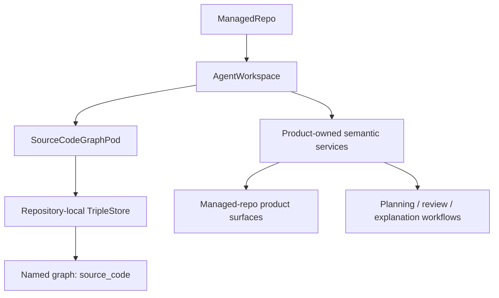

# 07. Source Code Graph And Semantic Services

This guide explains the repository-scoped semantic source-code graph and how it
is exposed to product code.

Current truth for this area lives in:

- [`../../.spec/specs/source_code_graph_product_adoption.spec.md`](https://github.com/mikehostetler/jido_code/blob/main/.spec/specs/source_code_graph_product_adoption.spec.md)
- [`../../.spec/specs/source_code_graph_pod.spec.md`](https://github.com/mikehostetler/jido_code/blob/main/.spec/specs/source_code_graph_pod.spec.md)
- [`../../lib/jido_code/source_code_graph/`](https://github.com/mikehostetler/jido_code/tree/main/lib/jido_code/source_code_graph)
- [`../../lib/jido_code/agent_workspace.ex`](https://github.com/mikehostetler/jido_code/blob/main/lib/jido_code/agent_workspace.ex)

## What The Source Code Graph Is

The source-code graph is a repository-scoped semantic representation of the code
base.

It supports repository-wide structural questions such as:

- module discovery
- function discovery
- bounded impact tracing
- runtime-pattern lookup
- richer explanation and review context

It is explicitly repository-local runtime state, not product truth.

## Topology

## Important Boundary

Product code should not:

- issue raw SPARQL directly from UI code
- reach into pod internals from product surfaces
- open the triple store directly from LiveViews

Instead, product code should go through:

- `AgentWorkspace`
- product-owned semantic services
- product-owned view models and workflow services

That keeps semantic behavior bounded and explainable.

## Lifecycle Is Explicit

The graph is not assumed to be ambiently fresh.

The expected lifecycle is:

1. analyze
2. load or refresh
3. query

This explicit lifecycle matters because freshness, stale state, degraded query
behavior, and recovery are part of the product contract.

## Product Adoption Pattern

The source-code graph is intended to enrich canonical product surfaces rather
than creating a separate graph application.

Examples:

- managed-repo detail can host semantic inspection
- workflows can opt into semantic context
- semantic findings can become governed work or evidence

That means semantic output should rejoin records like:

- `Observation`
- `Assessment`
- `WorkItem`
- `Evidence`
- `Decision`

## Workflow Opt-In

Planning, review, and explanation can explicitly request semantic context.

That is why `AgentWorkspace` accepts semantic workflow options instead of
assuming graph context is always present. The semantic path is an enhancement,
not a hidden dependency.

## Freshness, Stale State, And Recovery

Product-facing semantic surfaces should expose:

- ready vs not ready
- stale vs current
- latest failure
- explicit recovery affordances

The system should not pretend the graph is current when it is degraded.

## When To Use The Graph

Use it when you need:

- cross-file structure
- repeated semantic repository questions
- impact tracing
- runtime pattern lookups

Prefer ordinary file reads and code inspection when you need:

- exact latest source text
- line-level edits
- trivial one-off file inspection

## What Contributors Should Keep In Mind

- the source-code graph is repository-scoped, not global
- it is product-owned through bounded services
- it should enrich managed-repo and governed surfaces, not replace them
- its findings matter only after they rejoin governed records

## Read Next

Continue with
[`08-memory-graph-and-workflow-provenance.md`](https://github.com/mikehostetler/jido_code/blob/main/docs/developer/08-memory-graph-and-workflow-provenance.md).

