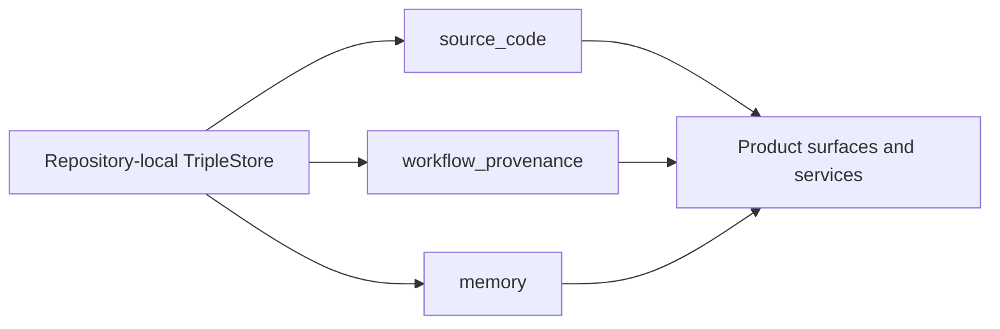
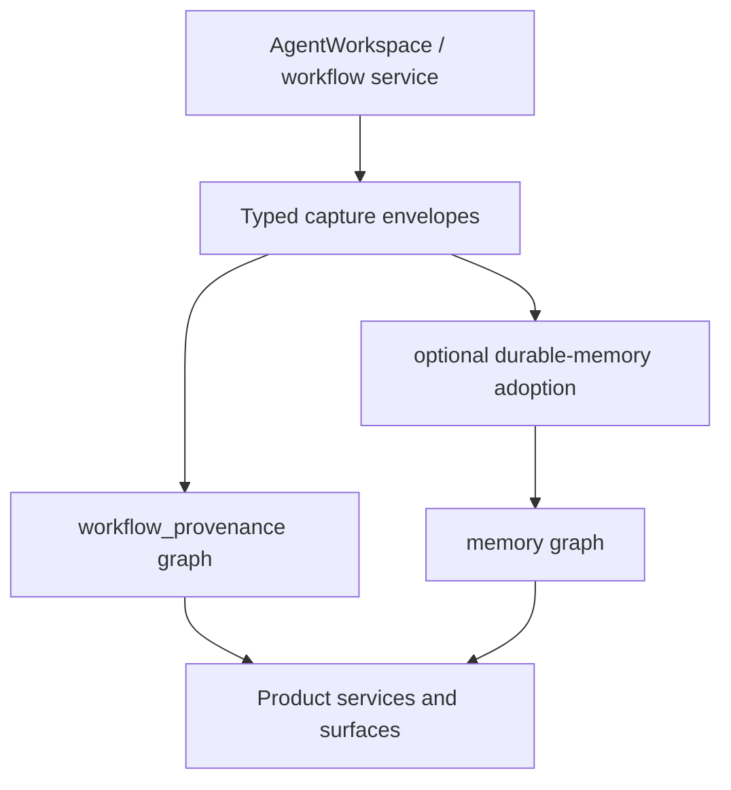

# 08. Memory Graph And Workflow Provenance

<!-- covers: docs.product_foundation.memory_ontology_guide_present -->
<!-- covers: docs.product_foundation.workflow_provenance_ontology_guide_present -->

This guide explains how repository-scoped memory and workflow provenance work in
`jido_code`.

Useful implementation sources:

- [`../../lib/jido_code/memory_graph/`](https://github.com/mikehostetler/jido_code/tree/main/lib/jido_code/memory_graph)
- [`../../lib/jido_code/agent_workspace.ex`](https://github.com/mikehostetler/jido_code/blob/main/lib/jido_code/agent_workspace.ex)

## Two Related Graphs

The memory stack is really two closely related layers:

- `workflow_provenance`
- `memory`

`workflow_provenance` captures bounded operational history.

`memory` stores intentionally adopted durable lessons, decisions, conventions,
patterns, questions, issues, and similar semantic knowledge.

## Named Graph Topology

## What Workflow Provenance Is For

Workflow provenance captures bounded execution envelopes such as:

- work sessions
- prompt turns
- agent runs
- tool invocations
- plans
- patches
- reviews

This provenance is inserted at workspace and product workflow seams, not by
letting specialist nodes write arbitrary triples directly.

## What Durable Memory Is For

Durable memory is not just "anything the model said."

It is intended for intentionally adopted knowledge such as:

- facts worth preserving
- decisions
- conventions
- lessons learned
- patterns
- known issues
- open questions

The key word is adopted. Raw runtime output does not become durable memory
automatically.

## Capture Boundary

The capture seam is intentionally product-owned.

## Governed References

The repo has moved toward typed `governed_references` as the main cross-linking
contract.

That means captured memory or provenance should link back to governed product
objects in an explicit typed way instead of relying on looser generic
artifact-style naming.

This is part of keeping graph data aligned with the product control plane.

## Product Boundary

As with the source-code graph, product code should use:

- product-owned services
- view models
- `AgentWorkspace`

It should not expose:

- raw SPARQL
- raw RDF internals
- pod topology
- direct triple-store handles in UI code

## Workflow Opt-In

Planning, review, and explanation can request memory context explicitly.

That explicit opt-in matters for two reasons:

1. memory is a bounded enhancement, not ambient hidden context
2. freshness, validation, invalidation, and recovery need to remain visible

## Freshness And Recovery

Operator-facing memory and provenance surfaces should expose:

- freshness
- validation state
- invalidation state
- latest failure
- recovery controls

The product should remain legible even when the memory graph is stale or
degraded.

## What Is Not Durable Memory

These are important non-goals:

- prompt text is not durable memory just because it exists
- tool output is not durable memory just because it was produced
- conversation state is not durable memory by default
- graph-local facts are not product truth on their own

## Conversation Recall Rule

When a later surface needs conversation history, choose the boundary on purpose:

- Reopen the canonical repo-detail conversation route when you need transcript
  continuity, active supervision, or turn-by-turn detail.
- Use bounded conversation-origin recall when you need provenance-shaped origin
  context on memory or governed surfaces.
- Adopt durable memory only when a classified takeaway should persist beyond the
  transcript and provenance layers.

This keeps memory and governed surfaces explainable without turning them into
alternate chat browsers.

## Contributor Rule Of Thumb

Ask two questions:

1. Is this operational provenance or intentionally adopted memory?
2. Which governed product record should this support or rejoin?

That usually tells you which boundary to use.

## Read Next

Continue with
[`08b-memory-ontology-and-query-examples.md`](https://github.com/mikehostetler/jido_code/blob/main/docs/developer/08b-memory-ontology-and-query-examples.md),
then
[`08c-workflow-provenance-ontology-and-query-examples.md`](https://github.com/mikehostetler/jido_code/blob/main/docs/developer/08c-workflow-provenance-ontology-and-query-examples.md),
then
[`09-frontend-and-product-surfaces.md`](https://github.com/mikehostetler/jido_code/blob/main/docs/developer/09-frontend-and-product-surfaces.md).
