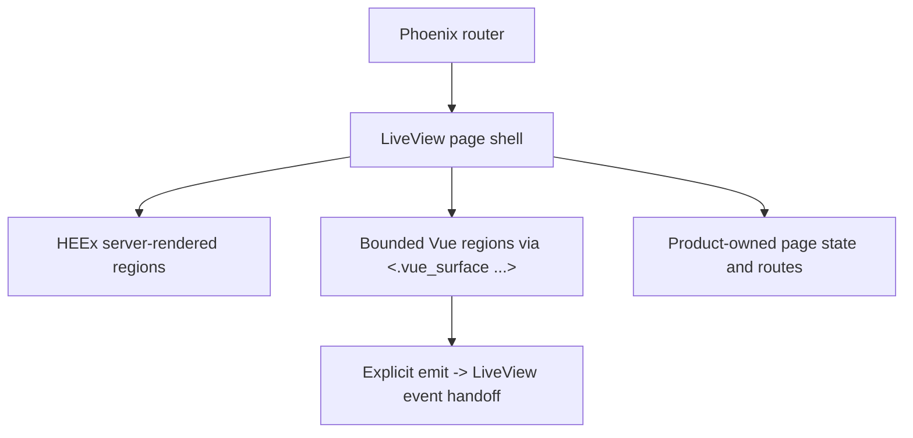

# 09. Frontend And Product Surfaces

This guide explains how browser-facing surfaces are structured in `jido_code`.

Useful implementation sources:

- [`../../lib/jido_code_web/`](https://github.com/mikehostetler/jido_code/tree/main/lib/jido_code_web)
- [`../../assets/`](https://github.com/mikehostetler/jido_code/tree/main/assets)

## Core Rule

LiveView remains the routed product host shell.

Vue is used through `live_vue` for bounded richer regions, not as a parallel SPA
or a replacement browser application.

The current UI is an ariston-style area shell: a LiveView-owned root workspace
with a top button menu, route-owned active area state, and a shared status
strip. The shell contract lives in `JidoCodeWeb.Areas`, `JidoCodeWeb.Layouts`,
and `JidoCodeWeb.AreaPanels`.

The component split follows the local `ariston-webui` reference: SaladUI backs
selected LiveView/HEEx primitives through app-owned wrappers, while generated
shadcn-vue assets live under `assets/vue/components/ui` and are used only
inside bounded LiveVue islands. DaisyUI, broad Vue auto-registration, and the
old subject-tree shell are obsolete implementation details, not compatibility
layers.

## Frontend Composition Model

## What Lives In LiveView

LiveView should own:

- routes
- auth and session boundaries
- the area button menu and shell status strip
- active area and detail-route ownership
- product page structure
- server-authored state
- straightforward forms and actions
- degraded fallback behavior

This keeps product ownership centralized.

## What Can Live In Vue

Vue regions are appropriate when a surface benefits from richer client-side
composition such as:

- graph exploration widgets
- more interactive inspection surfaces
- richer data exploration regions

Even then, the region should be mounted through the product boundary rather than
as an ad hoc client island.

## Boundary Rules

The boundary is intentionally explicit:

- LiveView owns the page
- LiveView owns the area button menu and shell status
- SaladUI primitives stay behind `JidoCodeWeb.Components.UI`
- generated shadcn-vue primitives stay inside Vue island assets under
  `assets/vue/components/ui`
- server-authored data crosses into Vue through bounded props or streams
- Vue emits route back into LiveView events
- production-mounted Vue islands are registered explicitly in `assets/vue/index.ts`
- degraded behavior remains product-oriented
- DaisyUI dependencies, DaisyUI classes, and route-local global chrome stay out

This keeps the browser stack explainable and testable.

## Choosing A Component Boundary

Use Phoenix core components for normal forms, links, icons, and simple
application-owned helpers that already exist in `core_components.ex`.

Use `JidoCodeWeb.Components.UI` when a LiveView surface needs a SaladUI
primitive such as cards, dialogs, tables, badges, alerts, separators, command
menus, popovers, tabs, scroll areas, skeletons, or tooltips. Product LiveViews
should import the app-owned boundary, not depend directly on `SaladUI.*`
modules unless a wrapper is being added.

Use generated shadcn-vue primitives only from Vue single-file components. They
are browser assets, not HEEx components.

## Adding A New Area

To add a new product area:

1. add the area metadata, route owner, handoffs, and shell defaults in
   `JidoCodeWeb.Areas`
2. add the Phoenix route or live action that owns the page
3. add an `AreaPanels` overview if the root area should show a shell overview
4. render the page under `<Layouts.app ...>` with the active area and shell
   state assigned by LiveView
5. extend `test/jido_code_web/live/operator_area_shell_live_test.exs` and the
   UI reset guardrails when the shell contract changes

## Adding A SaladUI Wrapper

To add a new LiveView primitive:

1. add the delegate or product wrapper in `JidoCodeWeb.Components.UI`
2. keep any product-specific behavior in app-owned component modules rather
   than scattering direct `SaladUI.*` usage
3. use token classes from `assets/css/app.css`, not DaisyUI classes
4. add focused component or LiveView tests for behavior and stable DOM IDs

## Adding A shadcn-vue Island

To add a bounded Vue region:

1. create the Vue component near its LiveView host under
   `lib/jido_code_web/live/`
2. import generated primitives from `@/vue/components/ui/*`
3. register the island explicitly in `assets/vue/index.ts`
4. mount it with `<.vue_surface ...>` and bounded `props:` or `streams:`
5. map emits with `events:` back into LiveView handlers
6. provide server-rendered fallback content so the workflow stays usable when
   assets, SSR, or the manifest degrade

Do not add `import.meta.glob` registration or expose generated primitive files
as LiveVue mount targets.

## Canonical Product Surfaces

The architecture emphasizes product-shaped routes such as:

- dashboard
- workbench
- managed-repository detail
- run detail
- bounded repo conversation surfaces

Semantic, memory, and conversation features should cohost inside those
canonical product surfaces rather than becoming separate apps.

## Failure Behavior

One of the explicit architecture goals is safe degradation.

If richer client delivery fails:

- the product should show bounded fallback messaging
- the operator should still understand what surface they are on
- raw Vite, SSR, or manifest internals should not leak through as the operator
  experience

## Testing Posture

The repo keeps LiveView tests as the main routed-surface harness.

Vue-aware helpers can be added where needed, but the architecture does not
assume a standalone SPA test posture. Use `mix frontend.verify` for the Vite,
SSR, explicit registry, generated primitive, and UI reset guardrails. Use
`mix ui_reset.verify` for focused no-DaisyUI, area shell, LiveVue boundary, and
fallback checks.

## Contributor Heuristics

When adding UI:

- start with LiveView
- introduce Vue only where the interaction genuinely benefits
- keep data ownership server-side unless it is truly presentation-local
- keep route and auth ownership in LiveView

## Read Next

Continue with
[`10-development-workflow-and-quality-gates.md`](https://github.com/mikehostetler/jido_code/blob/main/docs/developer/10-development-workflow-and-quality-gates.md).
