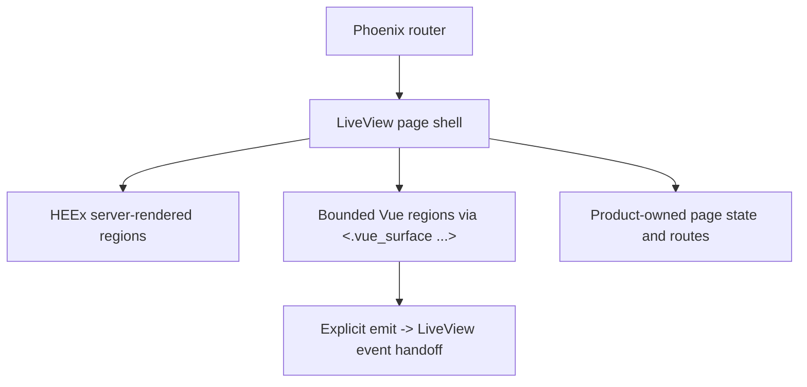

# 09. Frontend And Product Surfaces

This guide explains how browser-facing surfaces are structured in `jido_code`.

Current truth for this area lives in:

- [`../../.spec/specs/frontend_architecture.spec.md`](../../.spec/specs/frontend_architecture.spec.md)
- [`../../lib/jido_code_web/`](../../lib/jido_code_web/)
- [`../../assets/`](../../assets/)

## Core Rule

LiveView remains the routed product host shell.

Vue is used through `live_vue` for bounded richer regions, not as a parallel SPA
or a replacement browser application.

## Frontend Composition Model

## What Lives In LiveView

LiveView should own:

- routes
- auth and session boundaries
- product page structure
- server-authored state
- straightforward forms and actions
- degraded fallback behavior

This keeps product ownership centralized.

## What Can Live In Vue

Vue regions are appropriate when a surface benefits from richer client-side
composition such as:

- graph exploration widgets
- more interactive inspection surfaces
- richer data exploration regions

Even then, the region should be mounted through the product boundary rather than
as an ad hoc client island.

## Boundary Rules

The boundary is intentionally explicit:

- LiveView owns the page
- server-authored data crosses into Vue through bounded props or streams
- Vue emits route back into LiveView events
- degraded behavior remains product-oriented

This keeps the browser stack explainable and testable.

## Canonical Product Surfaces

The architecture emphasizes product-shaped routes such as:

- dashboard
- workbench
- managed-repository detail
- run detail
- bounded repo conversation surfaces

Semantic, memory, and conversation features should cohost inside those
canonical product surfaces rather than becoming separate apps.

## Failure Behavior

One of the explicit architecture goals is safe degradation.

If richer client delivery fails:

- the product should show bounded fallback messaging
- the operator should still understand what surface they are on
- raw Vite, SSR, or manifest internals should not leak through as the operator
  experience

## Testing Posture

The repo keeps LiveView tests as the main routed-surface harness.

Vue-aware helpers can be added where needed, but the architecture does not
assume a standalone SPA test posture.

## Contributor Heuristics

When adding UI:

- start with LiveView
- introduce Vue only where the interaction genuinely benefits
- keep data ownership server-side unless it is truly presentation-local
- keep route and auth ownership in LiveView

## Read Next

Continue with
[`10-development-workflow-and-quality-gates.md`](10-development-workflow-and-quality-gates.md).

