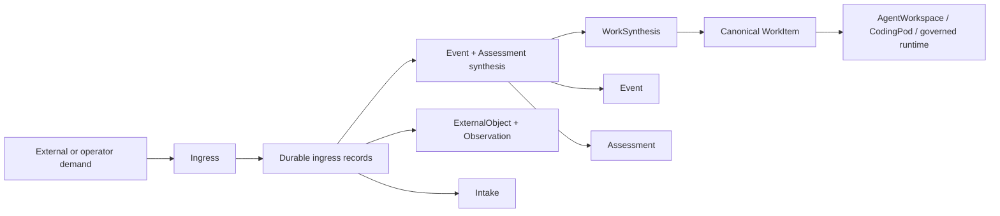

# 11. Ingress, Synthesis, And Work-Item Flow

This guide explains how inbound demand becomes canonical governed work in
`jido_code`, and how that same pipeline is used when a productive conversation
hands off from repo intake into a work-item-scoped coding loop.

Current truth for this area lives in:

- [`../../.spec/specs/demand_ingress.spec.md`](https://github.com/mikehostetler/jido_code/blob/main/.spec/specs/demand_ingress.spec.md)
- [`../../.spec/specs/event_assessment_synthesis.spec.md`](https://github.com/mikehostetler/jido_code/blob/main/.spec/specs/event_assessment_synthesis.spec.md)
- [`../../.spec/specs/work_synthesis.spec.md`](https://github.com/mikehostetler/jido_code/blob/main/.spec/specs/work_synthesis.spec.md)
- [`../../.spec/specs/conversation_orchestration.spec.md`](https://github.com/mikehostetler/jido_code/blob/main/.spec/specs/conversation_orchestration.spec.md)
- [`../../lib/jido_code/operations/ingress.ex`](https://github.com/mikehostetler/jido_code/blob/main/lib/jido_code/operations/ingress.ex)
- [`../../lib/jido_code/operations/synthesis.ex`](https://github.com/mikehostetler/jido_code/blob/main/lib/jido_code/operations/synthesis.ex)
- [`../../lib/jido_code/operations/work_synthesis.ex`](https://github.com/mikehostetler/jido_code/blob/main/lib/jido_code/operations/work_synthesis.ex)
- [`../../lib/jido_code/conversations/work_resolution.ex`](https://github.com/mikehostetler/jido_code/blob/main/lib/jido_code/conversations/work_resolution.ex)
- [`../../lib/jido_code/conversations/runtime.ex`](https://github.com/mikehostetler/jido_code/blob/main/lib/jido_code/conversations/runtime.ex)

## Why This Pipeline Exists

The product does not want UI clicks, webhook handlers, or conversation turns to
create hidden work directly.

Instead, it separates three concerns:

- `Ingress`: what entered the system, from whom, and for which repo
- `Synthesis`: what that demand means
- `WorkSynthesis`: whether that meaning becomes a canonical `WorkItem`

That gives the control plane:

- durable attribution
- stable repo correlation
- explicit interpretation
- deduplication and steering
- auditable work creation

## Mental Model

## The Concepts

### Ingress

`Ingress` is the normalization boundary.

It takes product entrypoints such as:

- GitHub webhook deliveries
- setup import actions
- workbench workflow kickoffs
- productive conversation handoff

and turns them into durable ingress records before work logic begins.

The two main record families are:

- `ExternalObject` plus `Observation` for verified external or system facts
- `Intake` for operator or trusted product requests

In practice:

- a GitHub issue webhook becomes an `ExternalObject` for the issue and an
  `Observation` for the fact that it was opened or edited
- a workbench or conversation request becomes an `Intake`

### Event And Assessment Synthesis

`Synthesis` sits between ingress and work creation.

It produces:

- an `Event`: what actionable occurrence happened
- an `Assessment`: what that occurrence means, how urgent it is, and what the
  recommended next action is

This is where the control plane turns "someone asked for X" into "this is an
operator work request with priority `:high` and recommended action Y."

### WorkSynthesis

`WorkSynthesis` turns a durable `Assessment` into a canonical `WorkItem`.

Its job is to decide whether to:

- create a new work item
- reuse an equivalent open work item
- reprioritize existing open work
- suppress duplicate demand
- steer an explicitly targeted existing work item

### WorkItem

`WorkItem` is the canonical operational record between assessment and execution.

It preserves:

- `managed_repo_id`
- origin links like `assessment_id`, `event_id`, `observation_id`, and
  `intake_id`
- category
- priority
- status
- recommended action
- initiating actor
- work metadata
- audit history

## Entry Points And Their Record Shape

| Entry point | Ingress record | Synthesis output | Work result |
| --- | --- | --- | --- |
| GitHub webhook | `ExternalObject` + `Observation` | `Event` + `Assessment` | usually a new or reused `WorkItem` |
| Workbench kickoff | `Intake` | `Event` + `Assessment` | usually a new or reused `WorkItem` |
| Setup import | `Intake` | `Event` + `Assessment` | usually a new or reused `WorkItem` |
| Productive conversation handoff | `Intake` with conversation metadata | `Event` + `Assessment` | a canonical `WorkItem` attached back to the conversation |

## Where Each Decision Lives

| Question | Boundary that answers it |
| --- | --- |
| Which repo is this for, and who asked for it? | `Ingress` |
| Is this an observation or an operator request? | `Ingress` |
| What category, priority, urgency, and next action does this imply? | `Synthesis` |
| Should we create new work, reuse old work, or steer existing work? | `WorkSynthesis` |
| When does a repo conversation become governed work? | `WorkResolution` |
| Which specialist should run, and with which bounded context path? | `Conversations.Runtime` |
| How does the LLM request actually run? | `AgentWorkspace` and the `CodingPod` specialist |

## Concrete Example

Use this example request on repo detail:

`Fix failing tests in test/jido_code/agent_workspace_test.exs`

### Step 1: Repo Intake Conversation Starts

Repo detail opens a conversation through `ProjectConversation` and the
conversation driver. The initial conversation is:

- `scope: :repo_scoped`
- `attachment_mode: :pre_work`
- no `work_item_id`

At this point it is still bounded intake, not canonical governed work.

### Step 2: The Turn Is Submitted

The operator submits:

`Fix failing tests in test/jido_code/agent_workspace_test.exs`

The command goes through:

- `AgentWorkspace.handle_conversation_command/3`
- `Conversations.Driver.handle_command/3`
- `Conversations.Coordinator.admit_command/3`

The coordinator creates a `Turn`, records events, and tries to activate it.

### Step 3: WorkResolution Promotes The Turn

Because repo-detail conversations use the real runtime path, the coordinator
calls `WorkResolution.ensure_turn_attachment/4` before long-lived execution
continues.

`WorkResolution` inspects the turn text and infers the workflow. Since the text
contains `fix`, it normally infers `:execute`.

Because:

- `:execute` is governed work
- the conversation is still `repo_scoped`
- there is no `work_item_id`

the system synthesizes governed work attachment instead of keeping execution as
repo-global chat state.

### Step 4: Conversation Demand Becomes Ingress

The conversation does not create a `WorkItem` directly.

Instead it records normalized operator intake with:

- `channel: "conversation"`
- `intent: "conversation_work_kickoff"`
- the instruction
- conversation, turn, and command identifiers
- bounded shared-context metadata

That happens through `Ingress.record_operator_intake/1`.

### Step 5: Ingress Becomes Event And Assessment

`Ingress.record_operator_intake/1` persists an `Intake`, then
`Synthesis.from_intake/1` creates:

- an `Event`
- an `Assessment`

For conversation kickoff, the current `Synthesis` mapping treats this as a
general conversation-originated operator work request. It does not currently use
the specialized workbench `fix_failing_tests` kickoff profile.

That means the conversation-originated request is interpreted as:

- a conversation work kickoff
- typed as durable operator demand
- suitable for canonical governed work creation

### Step 6: Assessment Becomes WorkItem

`WorkSynthesis.from_assessment/2` then decides whether to:

- create a new `WorkItem`
- reuse an equivalent open `WorkItem`
- or steer an existing `WorkItem`

For a first-time request like this, it usually creates a new open `WorkItem`
for the repo.

That work item keeps the important origin links:

- the `Intake`
- the `Event`
- the `Assessment`
- conversation-origin metadata in `work_metadata`

### Step 7: The Conversation Is Updated

Once the `WorkItem` exists, the original conversation is updated in place:

- `scope` changes from `:repo_scoped` to `:work_item_scoped`
- `attachment_mode` becomes `:synthesized_work_item`
- `work_item_id` is filled in
- handoff metadata records that repo intake promoted into governed work

So the same conversation record survives, but its canonical identity is now
bound to the `WorkItem`.

### Step 8: Real Runtime Execution Begins

Now that the conversation has governed scope, the child runtime starts through:

- `Coordinator`
- `ChildWorker`
- `Conversations.Runtime`

`Conversations.Runtime` builds a bounded instruction that includes:

- the repo objective
- workflow
- current request
- `managed_repo_id`
- `work_item_id`
- `workspace_path`
- referenced files
- accepted tool results
- clarification context

Then it chooses a context source:

- `:memory_workflow` for execute if memory is enabled
- `:workspace_with_semantic` if semantic is enabled and memory is not
- plain `:workspace` otherwise

### Step 9: AgentWorkspace Routes To The Specialist

For this example the runtime usually stays on `:execute`, so it ultimately calls
`AgentWorkspace.execute_work/4`, either directly or through the memory workflow
boundary.

That then:

- ensures the repo kernel
- ensures the `CodingPod` for that `WorkItem`
- ensures the `coder` specialist
- builds prompt and tool context
- runs the LLM-backed specialist

### Step 10: Runtime Events Flow Back Into The Conversation

The child runtime emits:

- `progress`
- `delta`
- `completed`
- or `needs_input`

The `ChildWorker` feeds those back into the canonical conversation event stream
as `tool_result.submit`, and the coordinator persists them into the event log
and snapshot.

## Example Record Timeline

For this single request, the important durable/control-plane records are
typically:

1. `Conversation` as repo intake
2. `Turn`
3. `Intake`
4. `Event`
5. `Assessment`
6. `WorkItem`
7. the same `Conversation`, now updated to `work_item_scoped`
8. `ChildWork`

One subtle point: this path does not automatically create a governed `Run`.
Conversation-driven specialist execution currently runs through the conversation
runtime plus `AgentWorkspace` and the `CodingPod`, not through a separate manual
workflow-launch run path.

## Important Nuance

The phrase `fix failing tests` is meaningful in two different layers:

- in conversation runtime, it usually causes workflow inference to choose
  `:execute`
- in work synthesis, conversation kickoff is still treated as generalized
  `conversation_work_kickoff` demand rather than the specialized workbench
  `fix_workflow_kickoff` pathway

That means:

- the runtime often behaves like implementation work
- the control-plane work classification is still more general unless upstream
  intent mapping changes

If you want conversation-originated fix requests to synthesize the same
specialized work profile as workbench launch, the place to change is usually the
mapping in `Synthesis`, not the `CodingPod`.

## Debugging Guide

If the behavior is wrong, start in the layer that owns that decision:

- Wrong repo correlation or actor attribution: check `Ingress`
- Wrong event category or recommended action: check `Synthesis`
- Wrong reuse or duplicate suppression: check `WorkSynthesis`
- Wrong repo-to-work-item handoff: check `WorkResolution` and `Conversations`
- Wrong specialist or prompt context: check `Conversations.Runtime` and
  `AgentWorkspace`
- Wrong tool/LLM behavior: check the specialist module in the `CodingPod`

## Tests To Read

These tests are especially good companions to this guide:

- [`../../test/jido_code/operations/work_synthesis_test.exs`](https://github.com/mikehostetler/jido_code/blob/main/test/jido_code/operations/work_synthesis_test.exs)
- [`../../test/jido_code/phase_forty_six_integration_test.exs`](https://github.com/mikehostetler/jido_code/blob/main/test/jido_code/phase_forty_six_integration_test.exs)
- [`../../test/jido_code/phase_forty_nine_integration_test.exs`](https://github.com/mikehostetler/jido_code/blob/main/test/jido_code/phase_forty_nine_integration_test.exs)
- [`../../test/jido_code/phase_fifty_one_integration_test.exs`](https://github.com/mikehostetler/jido_code/blob/main/test/jido_code/phase_fifty_one_integration_test.exs)

## Read Next

Read [`06-conversation-orchestration.md`](https://github.com/mikehostetler/jido_code/blob/main/docs/developer/06-conversation-orchestration.md) for
the broader runtime model, then
[`12-user-request-to-llm-message-path.md`](https://github.com/mikehostetler/jido_code/blob/main/docs/developer/12-user-request-to-llm-message-path.md)
for the exact prompt-transformation path, then
[`08-memory-graph-and-workflow-provenance.md`](https://github.com/mikehostetler/jido_code/blob/main/docs/developer/08-memory-graph-and-workflow-provenance.md)
for the bounded memory and provenance context that can flow into these
work-item-scoped specialist calls.
