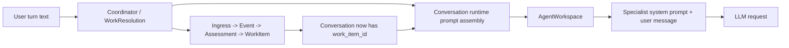

# 12. User Request To LLM Message Path

This guide explains what happens to a user request between:

- the moment an operator submits a conversation turn
- and the final message list sent to a specialist LLM

It focuses on one important question:

**Does ingress and work synthesis rewrite the prompt?**

The current answer is:

- `Ingress`, `Synthesis`, and `WorkSynthesis` create governed records and decide
  work identity
- they do **not** replace the actual user request that reaches the LLM
- the user request is transformed later by the conversation runtime and
  `AgentWorkspace` into a bounded specialist instruction

Useful implementation sources:

- [`../../lib/jido_code/conversations/runtime.ex`](https://github.com/mikehostetler/jido_code/blob/main/lib/jido_code/conversations/runtime.ex)
- [`../../lib/jido_code/context_budget.ex`](https://github.com/mikehostetler/jido_code/blob/main/lib/jido_code/context_budget.ex)
- [`../../lib/jido_code/conversations/work_resolution.ex`](https://github.com/mikehostetler/jido_code/blob/main/lib/jido_code/conversations/work_resolution.ex)
- [`../../lib/jido_code/conversations/coordinator.ex`](https://github.com/mikehostetler/jido_code/blob/main/lib/jido_code/conversations/coordinator.ex)
- [`../../lib/jido_code/agent_workspace.ex`](https://github.com/mikehostetler/jido_code/blob/main/lib/jido_code/agent_workspace.ex)
- [`../../lib/jido_code/agents/`](https://github.com/mikehostetler/jido_code/tree/main/lib/jido_code/agents)
- [`../../deps/jido_ai/lib/jido_ai/context.ex`](https://github.com/agentjido/jido_ai/blob/5601aa5eec5341a3cd62c951c029e53cd584a110/lib/jido_ai/context.ex)
- [`../../deps/jido_ai/lib/jido_ai/reasoning/react/runner.ex`](https://github.com/agentjido/jido_ai/blob/5601aa5eec5341a3cd62c951c029e53cd584a110/lib/jido_ai/reasoning/react/runner.ex)

## Short Answer

If an operator submits:

`Fix failing tests in test/jido_code/agent_workspace_test.exs`

the specialist still sees that request.

What changes around it are:

- governed work attachment and `WorkItem` creation
- workflow inference such as `:execute`
- bounded repo and work-item scope wrapping through context-budget sections
- optional semantic and memory prompt projections
- the specialist's own system prompt

What does **not** happen is:

- replacing the request with the `Assessment` summary
- replacing the request with the `WorkItem` summary
- handing the specialist only the normalized ingress records

## Big Picture



## The Two Parallel Things Happening

When a productive conversation turn arrives, two related but distinct things
happen:

### 1. Governed work is resolved

This path decides:

- does the turn need a `WorkItem`
- should work be created, reused, or steered
- what is the canonical governed scope

That is the `Ingress -> Synthesis -> WorkSynthesis` side.

### 2. The LLM request is assembled

This path decides:

- which workflow is being requested
- which specialist should run
- how the user request is wrapped with bounded context
- which system prompt and tools apply

That is the `Conversations.Runtime -> AgentWorkspace -> specialist` side.

These happen together, but they are not the same thing.

## What Ingress Changes And What It Does Not

| Layer | Changes governed records? | Changes LLM prompt text? |
| --- | --- | --- |
| `Ingress` | Yes | No |
| `Synthesis` | Yes | No |
| `WorkSynthesis` | Yes | No |
| `WorkResolution` | Yes, and helps choose workflow | Not directly |
| `Conversations.Runtime` | No | Yes |
| `AgentWorkspace` | No | Yes |
| specialist module | No | Yes, via system prompt and tools |

So the correct mental model is:

- control-plane layers decide work identity
- runtime layers decide prompt shape

## Exact Transformation Stages

### Stage 1: Raw user turn text

The turn starts as operator text in the turn payload, for example:

`Fix failing tests in test/jido_code/agent_workspace_test.exs`

That value is still visible as the request later in
`Conversations.Runtime.build_request/2` through `runtime_spec[:instruction]` in
[`runtime.ex`](https://github.com/mikehostetler/jido_code/blob/main/lib/jido_code/conversations/runtime.ex).

### Stage 2: Workflow inference and governed work resolution

`WorkResolution` inspects the text and infers a workflow like:

- `:plan`
- `:execute`
- `:refactor`
- `:review`
- `:explain`

For words like `fix`, `change`, `edit`, or `patch`, it usually infers
`:execute`.

For explicit behavior-preserving refactor requests, such as extracting shared
logic, renaming structure, deduplicating code, or simplifying code without
changing behavior, it infers `:refactor` and later dispatches through
`AgentWorkspace.refactor_work/3,4`.

If refactor and execute or review signals are mixed without clear intent, the
runtime should ask for clarification instead of silently choosing a specialist.

This matters because it decides:

- whether the turn needs governed work attachment
- which specialist path is likely to run later

But this does **not** replace the raw request text.

### Stage 3: Conversation handoff creates governed work

If the conversation is still repo-scoped and the turn is productive,
`Ingress.record_operator_intake/1` is called through work resolution.

That creates:

- `Intake`
- `Event`
- `Assessment`
- `WorkItem`

The conversation is then updated to include the new `work_item_id`.

This changes the governed identity of the conversation, not the actual user
request string.

### Stage 4: Conversation runtime builds a bounded instruction

After governed scope is established, `Conversations.Runtime` builds the
instruction string that it passes downstream.

The runtime keeps the original request as:

- `user_instruction`
- and also embeds it into the bounded instruction as `Current request: ...`

The bounded instruction is packed from context-budget sections:

- repository conversation objective
- workflow
- current request
- `managed_repo_id`
- `work_item_id`
- `workspace_path`
- source
- referenced files
- accepted tool results
- clarification context
- bounded guidance

So this is a transformation, but it is an additive wrapper, not a substitution.
If optional sections are too large, the runtime trims them and records compact
budget diagnostics. The current request and governed repository/work-item scope
remain required.

### Stage 5: AgentWorkspace may wrap the instruction again

`AgentWorkspace` may further transform the instruction through the same context
budget boundary.

If no semantic or memory context exist, the instruction can pass through almost
unchanged.

If semantic or memory context exists, the workspace projects it into compact
prompt lines shaped like:

```text
Workflow: execute
Instruction: <bounded instruction from conversation runtime>

Semantic context:
%{...}

Memory context:
freshness: Memory graph ready
policy_intent: implementation_constraints
memory: Decision: ...
```

This is the main prompt-level transformation after conversation runtime.
The full graph context remains available to tools through `tool_context`; the
prompt projection is only the bounded text the model sees directly.

### Stage 6: The specialist adds the system prompt

Once the request reaches the chosen specialist:

- `planner`
- `coder`
- `reviewer`
- `refactorer`
- `explainer`

the specialist contributes:

- its system prompt
- its tools
- its model
- its existing specialist-local turn history

That system prompt is prepended as the `system` message through
`AIContext.to_messages/2`.

### Stage 7: Final provider request

The final provider request is built from:

- `messages`
- `tools`
- `llm_opts`

The messages come from:

- specialist `system_prompt`
- prior specialist-local history
- the current transformed user message

The `CodingPod` specialists receive budgeted current-turn instructions. The
ReAct history projection is still handled by the specialist runtime layer.

## Concrete Example

Start with this repo-detail conversation request:

`Fix failing tests in test/jido_code/agent_workspace_test.exs`

### What the control plane does with it

- infers it is productive work
- usually infers workflow `:execute`
- creates or reuses a canonical `WorkItem`
- attaches the conversation to that work item

### What the runtime does with it

It preserves the request and turns it into something shaped roughly like:

```text
Repository conversation objective: Coordinate managed repository work.
Workflow: execute
Current request: Fix failing tests in test/jido_code/agent_workspace_test.exs
Repository scope:
- managed_repo_id: ...
- work_item_id: ...
- workspace_path: ...
- source: project_detail

Referenced files:
- test/jido_code/agent_workspace_test.exs

Guidance:
- Stay within the current repository and governed work item unless the conversation explicitly changes scope.
- Treat referenced files and accepted tool results as bounded context, and confirm details against the current source before making claims.
```

Then `AgentWorkspace` may wrap that again as:

```text
Workflow: execute
Instruction: <the bounded instruction above>

Memory context:
freshness: Memory graph ready
policy_intent: implementation_constraints
memory: Decision: ...
```

Then the `coder` system prompt is added above it as the `system` message.

For a request like:

`Refactor the parser helpers to extract duplication while preserving behavior`

the same path preserves that text, infers workflow `:refactor`, attaches
governed work, and routes the bounded instruction to the Refactorer specialist
through `AgentWorkspace.refactor_work/3,4`.

## What Actually Reaches The Model

The effective LLM messages look conceptually like:

```text
[system]
You are the coding specialist for JidoCode...

[user]
Workflow: execute
Instruction: Repository conversation objective: ...
Current request: Fix failing tests in test/jido_code/agent_workspace_test.exs
...
```

Potentially followed by:

- prior specialist-local history
- tool result messages from the same specialist thread

## What Can Meaningfully Change The LLM Outcome

These things can change how the request is interpreted:

- workflow inference choosing planner vs coder vs reviewer
- clarification logic asking for a file/module before proceeding
- semantic context injection
- memory context injection
- specialist system prompt
- tool availability

These things do **not** by themselves replace the request:

- ingress normalization
- event creation
- assessment creation
- work-item synthesis

## The Real Risk Areas

If the model seems not to be "hearing" the request, the likely causes are:

- the wrong workflow was inferred
- the wrong specialist was selected
- semantic or memory context wrapped the prompt in a distracting way
- the system prompt is steering behavior strongly
- the request lacked enough concrete file/module scope and triggered clarification

The likely cause is **not** that `Ingress` swallowed the prompt.

## Debugging Checklist

When debugging a bad result, inspect these layers in order:

1. The original `turn.submit` payload
2. `WorkResolution` workflow inference
3. `Conversations.Runtime` bounded instruction
4. `AgentWorkspace` prompt projection and context-budget summary
5. specialist choice
6. specialist system prompt
7. tool list and tool results

That order usually finds the bug much faster than starting at the provider edge.

## Companion Guides

- [`05-specialist-prompts-context-and-tool-execution.md`](https://github.com/mikehostetler/jido_code/blob/main/docs/developer/05-specialist-prompts-context-and-tool-execution.md)
- [`06-conversation-orchestration.md`](https://github.com/mikehostetler/jido_code/blob/main/docs/developer/06-conversation-orchestration.md)
- [`11-ingress-synthesis-and-work-item-flow.md`](https://github.com/mikehostetler/jido_code/blob/main/docs/developer/11-ingress-synthesis-and-work-item-flow.md)
