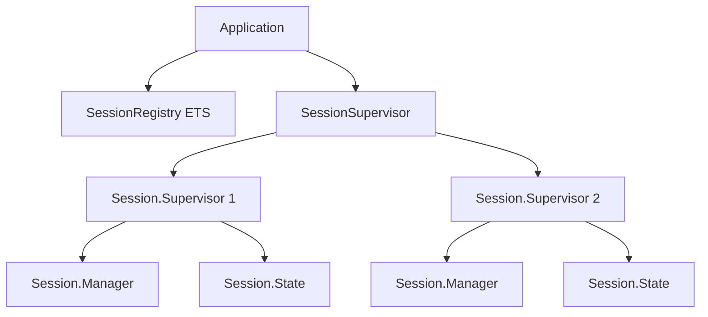

# WS-7.5: Documentation - Feature Planning

**Branch**: `feature/ws-7.5-documentation`
**Date**: 2025-12-12
**Status**: 📋 Planning
**Phase**: 7 (Testing and Polish)

---

## Problem Statement

The work-session feature (Phases 1-6) is fully implemented and tested (Tasks 7.1-7.4 complete), but lacks comprehensive documentation for both end users and developers. Without proper documentation:

1. **Users** struggle to understand:
   - How to use session commands effectively
   - What keyboard shortcuts are available
   - How session persistence works
   - When sessions are saved/restored
   - What the 10-session limit means

2. **Developers** struggle to understand:
   - The session architecture and supervision tree
   - How to add session-aware tools
   - The persistence format and versioning
   - How sessions integrate with the TUI
   - Security boundaries and validation

3. **Module Documentation** is incomplete:
   - Some new modules lack `@moduledoc`
   - Public functions missing `@doc`
   - Type specs missing or incomplete
   - `mix docs` has warnings

This makes the feature harder to use and maintain.

---

## Solution Overview

Create comprehensive, layered documentation targeting three audiences:

1. **End Users** - Guides for using the session feature
2. **Developers** - Architecture docs for extending the system
3. **API Documentation** - Complete module/function documentation

### Documentation Structure

```
jido_code/
├── CLAUDE.md (updated with session docs)
├── guides/
│   ├── user/
│   │   ├── sessions.md              # Complete session user guide
│   │   ├── keyboard-shortcuts.md    # All keyboard shortcuts
│   │   └── session-faq.md           # Common questions
│   └── developer/
│       ├── session-architecture.md  # Architecture deep dive
│       ├── adding-session-tools.md  # How to add session-aware tools
│       └── persistence-format.md    # Persistence schema & versioning
├── notes/
│   └── architecture/
│       └── work-session.md          # Visual architecture diagram
└── lib/jido_code/
    └── session/                     # All modules have complete docs
```

---

## Implementation Plan

### Phase 1: User Documentation (7.5.1)

Create user-facing guides for the session feature.

#### Task 7.5.1.1: Create User Guides Directory

**Deliverable**: `guides/user/` directory structure

**Steps**:
1. Create `guides/user/` directory
2. Add `.gitkeep` or initial README
3. Verify directory is tracked in git

**Success Criteria**:
- Directory exists and is committed

#### Task 7.5.1.2: Write Session User Guide

**Deliverable**: `guides/user/sessions.md`

**Content Sections**:
1. **Introduction**
   - What are sessions?
   - Why use multiple sessions?
   - When to use sessions vs single workspace

2. **Basic Usage**
   - Creating a new session
   - Switching between sessions
   - Closing sessions
   - Renaming sessions

3. **Session Commands**
   - `/session` - Overview and help
   - `/session new [path]` - Create new session (with `--name=` option)
   - `/session list` - List all sessions
   - `/session switch <target>` - Switch by index, ID, or name
   - `/session close [target]` - Close session
   - `/session rename <name>` - Rename active session

4. **Session Persistence**
   - Automatic saving on close
   - `/resume` - List resumable sessions
   - `/resume <target>` - Resume by index or ID
   - `/resume delete <target>` - Delete saved session
   - `/resume clear` - Delete all saved sessions

5. **Session Limits**
   - 10-session maximum
   - What happens when limit reached
   - How to manage sessions

6. **Examples**
   - Common workflows
   - Multi-project development
   - Switching contexts

**Format**: Markdown with code examples

**Success Criteria**:
- All commands documented with examples
- Clear, beginner-friendly language
- Includes common use cases

#### Task 7.5.1.3: Write Keyboard Shortcuts Guide

**Deliverable**: `guides/user/keyboard-shortcuts.md`

**Content Sections**:
1. **Session Shortcuts**
   - `Ctrl+1` to `Ctrl+9` - Switch to session 1-9
   - `Ctrl+0` - Switch to session 10
   - `Ctrl+Tab` - Next session
   - `Ctrl+Shift+Tab` - Previous session
   - `Ctrl+W` - Close current session
   - `Ctrl+N` - New session dialog

2. **Agent Shortcuts**
   - `Ctrl+R` - Toggle reasoning panel
   - `Ctrl+M` - Model selection menu

3. **Input Shortcuts**
   - `Enter` - Submit message
   - `Ctrl+C` - Quit application
   - Standard text editing

**Format**: Markdown table with descriptions

**Success Criteria**:
- All keyboard shortcuts documented
- Organized by category
- Easy to scan/reference

#### Task 7.5.1.4: Write Session FAQ

**Deliverable**: `guides/user/session-faq.md`

**Content** (Q&A format):

1. **What happens to my session when I close it?**
   - Automatically saved to `~/.jido_code/sessions/`
   - Includes full conversation history
   - Includes todo list state
   - Can be resumed later

2. **How do I resume a session?**
   - Use `/resume` to list saved sessions
   - Use `/resume <number>` or `/resume <id>` to restore
   - Session restores to exact state when closed

3. **Can I have multiple sessions for the same project?**
   - No, one session per project path
   - Duplicate path detection prevents conflicts
   - Rename session to differentiate contexts

4. **What is the 10-session limit?**
   - Maximum 10 concurrent sessions
   - Based on typical workflow needs
   - Close unused sessions to free slots
   - Saved sessions don't count toward limit

5. **Where are sessions saved?**
   - `~/.jido_code/sessions/<session_id>.json`
   - Encrypted with project-specific key
   - Safe to delete manually if needed

6. **What happens if I delete a project directory?**
   - Session becomes invalid
   - Resume will fail with error
   - Use `/resume delete` to clean up

7. **Can I rename a session after creation?**
   - Yes, use `/session rename <name>`
   - Name shown in tab bar
   - Doesn't affect project path

8. **How do I see all my sessions?**
   - Active: `/session list`
   - Saved: `/resume`
   - Tab bar shows active sessions

9. **What's saved in a session?**
   - Conversation history
   - Todo list
   - LLM configuration
   - Project path
   - Session metadata

10. **Can I export/import sessions?**
    - Not yet implemented
    - Sessions are JSON files (can be copied)
    - Future enhancement planned

**Success Criteria**:
- Answers common questions
- Clear, concise answers
- Covers edge cases

#### Task 7.5.1.5: Update CLAUDE.md

**Deliverable**: Updated `CLAUDE.md` with session documentation

**Changes**:

1. **Update Project Overview** (line 8):
   ```markdown
   - **Work Sessions** - Multi-session workspace management with persistence
   ```

2. **Add Session System to Architecture** (after line 46):
   ```markdown
   ├─────────────────────────────┼────────────────────────────────┤
   │                       Session Layer                           │
   │  ┌─────────────────────────────────────────────────────────┐  │
   │  │ SessionRegistry (ETS, max 10 sessions)                  │  │
   │  │ SessionSupervisor (DynamicSupervisor)                   │  │
   │  │   ├── Session.Supervisor (per-session tree)            │  │
   │  │   │   ├── Session.Manager (security, tool context)     │  │
   │  │   │   └── Session.State (conversation, todos)          │  │
   │  │   └── ... (up to 10 sessions)                          │  │
   │  └─────────────────────────────────────────────────────────┘  │
   ```

3. **Add Session Modules to Key Modules** (after line 66):
   ```markdown
   | `JidoCode.Session` | Session struct with validation and updates |
   | `JidoCode.SessionRegistry` | ETS-backed session registry with 10-session limit |
   | `JidoCode.SessionSupervisor` | DynamicSupervisor for session processes |
   | `JidoCode.Session.Supervisor` | Per-session supervision tree |
   | `JidoCode.Session.Manager` | Session-scoped security and tool context |
   | `JidoCode.Session.State` | Conversation history and todo list state |
   | `JidoCode.Session.Persistence` | Save/load sessions to `~/.jido_code/sessions/` |
   | `JidoCode.Session.Settings` | Session-scoped settings management |
   ```

4. **Add Session PubSub Topics** (after line 194):
   ```elixir
   # Session Events
   "session.events"                 # Global session lifecycle events
   "session.#{session_id}"          # Session-specific events

   # Message Types
   {:session_created, session}      # New session created
   {:session_closed, session_id}    # Session closed and saved
   {:session_switched, session_id}  # Active session changed
   {:session_renamed, session_id, name} # Session renamed
   ```

5. **Add Session Commands Section** (before Available Tools):
   ```markdown
   ## Session Commands

   See `guides/user/sessions.md` for complete documentation.

   | Command | Description |
   |---------|-------------|
   | `/session new [path]` | Create new session (--name=NAME for custom name) |
   | `/session list` | List all active sessions |
   | `/session switch <target>` | Switch by index, ID, or name |
   | `/session close [target]` | Close session (default: active) |
   | `/session rename <name>` | Rename current session |
   | `/resume` | List resumable sessions |
   | `/resume <target>` | Resume by index or ID |
   | `/resume delete <target>` | Delete saved session |
   | `/resume clear` | Delete all saved sessions |

   Keyboard shortcuts: Ctrl+1 to Ctrl+0 switch to sessions 1-10.
   ```

6. **Update PubSub Topics** - Add session-specific topics

**Success Criteria**:
- CLAUDE.md reflects session system
- Architecture diagram updated
- Commands documented
- Links to detailed guides

---

### Phase 2: Developer Documentation (7.5.2)

Create developer-facing architecture and implementation guides.

#### Task 7.5.2.1: Create Developer Guides Directory

**Deliverable**: `guides/developer/` directory structure

**Steps**:
1. Create `guides/developer/` directory
2. Add `.gitkeep` or initial README
3. Verify directory is tracked in git

**Success Criteria**:
- Directory exists and is committed

#### Task 7.5.2.2: Write Session Architecture Guide

**Deliverable**: `guides/developer/session-architecture.md`

**Content Sections**:

1. **Overview**
   - Purpose of session system
   - Key design decisions
   - Architecture philosophy

2. **Supervision Tree**
   ```
   Application.Supervisor
   ├── SessionRegistry (ETS table creation)
   ├── SessionSupervisor (DynamicSupervisor)
   │   ├── Session.Supervisor (session_1)
   │   │   ├── Session.Manager
   │   │   └── Session.State
   │   ├── Session.Supervisor (session_2)
   │   │   ├── Session.Manager
   │   │   └── Session.State
   │   └── ... (up to 10)
   └── ...
   ```
   - Explanation of each component
   - Restart strategies
   - Process registration

3. **Session Lifecycle**
   - Creation flow
   - Registration and validation
   - Process startup
   - State management
   - Persistence
   - Cleanup and termination

4. **Data Flow**
   - User input → TUI → Commands
   - Session selection
   - Message routing
   - Tool execution context
   - State updates
   - Persistence triggers

5. **Process Communication**
   - Registry lookups
   - PubSub events
   - GenServer calls
   - State synchronization

6. **Security Model**
   - Path validation per session
   - Tool context isolation
   - Manager sandbox boundaries
   - Settings hierarchy

7. **Concurrency**
   - ETS for session registry
   - Process isolation
   - Concurrent session operations
   - Race condition handling

**Diagrams**: Mermaid or ASCII diagrams for flows

**Success Criteria**:
- Complete architectural overview
- Clear process flow diagrams
- Security model explained

#### Task 7.5.2.3: Write Persistence Format Guide

**Deliverable**: `guides/developer/persistence-format.md`

**Content Sections**:

1. **Storage Location**
   - `~/.jido_code/sessions/`
   - File naming: `<session_id>.json`
   - Encryption at rest

2. **Schema Version 1**
   - Complete JSON schema
   - Field descriptions
   - Type constraints

   ```json
   {
     "version": 1,
     "id": "uuid-v4",
     "name": "session-name",
     "project_path": "/absolute/path",
     "config": {
       "provider": "anthropic",
       "model": "claude-3-5-sonnet-20241022",
       "temperature": 0.7,
       "max_tokens": 4096
     },
     "created_at": "2024-01-01T00:00:00Z",
     "updated_at": "2024-01-01T12:00:00Z",
     "closed_at": "2024-01-01T12:30:00Z",
     "conversation": [
       {
         "id": "msg-uuid",
         "role": "user",
         "content": "message text",
         "timestamp": "2024-01-01T12:00:00Z"
       }
     ],
     "todos": [
       {
         "content": "Run tests",
         "status": "pending",
         "active_form": "Running tests"
       }
     ]
   }
   ```

3. **Serialization**
   - `Session.Persistence.Serialization` module
   - `to_json/2` - Session → JSON
   - `from_json/1` - JSON → Session
   - Message conversion
   - Todo conversion

4. **Encryption**
   - `Session.Persistence.Crypto` module
   - AES-256-GCM encryption
   - Per-session key derivation
   - Salt and IV handling

5. **Schema Validation**
   - `Session.Persistence.Schema` module
   - Field validation
   - Type checking
   - Error handling

6. **Versioning Strategy**
   - `version` field for migrations
   - Future schema changes
   - Backward compatibility
   - Migration process (future)

7. **Error Handling**
   - Corrupted file handling
   - Missing fields
   - Type mismatches
   - Decryption failures

**Success Criteria**:
- Complete schema documentation
- Versioning strategy clear
- Error handling documented

#### Task 7.5.2.4: Write Adding Session Tools Guide

**Deliverable**: `guides/developer/adding-session-tools.md`

**Content Sections**:

1. **Session-Aware vs Session-Agnostic Tools**
   - What makes a tool session-aware
   - When to use session context
   - Tool isolation guarantees

2. **Tool Context**
   - `context.session_id` field
   - Getting current session
   - Accessing session state
   - Security boundaries

3. **Example: Session-Aware Tool**
   ```elixir
   defmodule JidoCode.Tools.Handlers.MyTool do
     def execute(args, context) do
       # Get session ID from context
       session_id = context.session_id

       # Lookup session
       {:ok, session} = SessionRegistry.lookup(session_id)

       # Use session-scoped paths
       full_path = Path.join(session.project_path, args["file"])

       # Validate within session boundary
       with :ok <- Manager.validate_path(session_id, full_path) do
         # Perform operation
         {:ok, "result"}
       end
     end
   end
   ```

4. **Best Practices**
   - Always use `context.session_id`
   - Validate paths via Manager
   - Don't store session state in tools
   - Use PubSub for session events
   - Handle session not found errors

5. **Testing Session-Aware Tools**
   - Creating test sessions
   - Mocking session context
   - Boundary testing
   - Integration tests

**Success Criteria**:
- Clear examples
- Best practices documented
- Testing guidance included

#### Task 7.5.2.5: Create Architecture Diagram

**Deliverable**: `notes/architecture/work-session.md`

**Content**:

1. **Visual Architecture Diagram**
   - Mermaid diagram of supervision tree
   - Data flow diagrams
   - Component relationships

2. **Component Descriptions**
   - Each module's role
   - Interactions
   - Dependencies

3. **Sequence Diagrams**
   - Session creation flow
   - Message handling flow
   - Tool execution flow
   - Save/resume flow

**Example Diagram** (Mermaid):


**Success Criteria**:
- Clear visual representation
- Covers all major flows
- Useful for onboarding

---

### Phase 3: Module Documentation (7.5.3)

Complete module-level API documentation.

#### Task 7.5.3.1: Audit Module Documentation

**Deliverable**: List of modules needing docs

**Steps**:
1. Check all session-related modules
2. Identify missing `@moduledoc`
3. Identify missing `@doc`
4. Identify missing `@spec`

**Modules to Audit**:
- `JidoCode.Session`
- `JidoCode.SessionRegistry`
- `JidoCode.SessionSupervisor`
- `JidoCode.Session.Supervisor`
- `JidoCode.Session.Manager`
- `JidoCode.Session.State`
- `JidoCode.Session.Persistence`
- `JidoCode.Session.Persistence.Schema`
- `JidoCode.Session.Persistence.Serialization`
- `JidoCode.Session.Persistence.Crypto`
- `JidoCode.Session.Settings`
- `JidoCode.Session.AgentAPI`
- `JidoCode.Session.ProcessRegistry`
- `JidoCode.Commands` (session commands)
- `JidoCode.TUI` (session integration)

**Success Criteria**:
- Complete audit checklist
- Prioritized list of fixes

#### Task 7.5.3.2: Add Missing @moduledoc

**Deliverable**: All modules have `@moduledoc`

**Standards**:
1. **First Line**: One-sentence summary
2. **Purpose**: What the module does
3. **Architecture**: How it fits in the system
4. **Usage**: Basic examples
5. **See Also**: Related modules

**Example**:
```elixir
@moduledoc """
Manages session-scoped security boundaries and tool context.

The Session.Manager provides a sandboxed environment for each session,
ensuring tools can only access paths within the session's project directory.
It integrates with the Tools.Manager for Lua sandbox execution.

## Architecture

Each session gets its own Manager process supervised by Session.Supervisor.
The Manager maintains:
- Project path boundary
- Active working directory
- Lua sandbox state

## Usage

    # Manager is started automatically with session
    {:ok, session} = SessionSupervisor.create_session(project_path: "/tmp/project")

    # Validate a path within session boundary
    Manager.validate_path(session_id, "/tmp/project/file.txt")
    #=> :ok

See `JidoCode.Tools.Manager` for the underlying sandbox implementation.
"""
```

**Success Criteria**:
- All modules have clear `@moduledoc`
- Follows consistent format
- Includes examples where appropriate

#### Task 7.5.3.3: Add Missing @doc

**Deliverable**: All public functions have `@doc`

**Standards**:
1. **Summary**: What the function does
2. **Parameters**: Each parameter explained
3. **Returns**: Possible return values
4. **Errors**: Error cases and reasons
5. **Examples**: Usage examples

**Example**:
```elixir
@doc """
Validates a path is within the session's project boundary.

Checks that the given path:
- Is an absolute path
- Exists within the session's project_path
- Does not contain traversal sequences
- Does not escape via symlinks

## Parameters

- `session_id` - The session's unique ID
- `path` - Absolute path to validate

## Returns

- `:ok` - Path is valid and within boundary
- `{:error, :path_outside_boundary}` - Path escapes session boundary
- `{:error, :path_traversal}` - Path contains .. sequences
- `{:error, :session_not_found}` - Session doesn't exist

## Examples

    iex> Manager.validate_path(session_id, "/tmp/project/file.txt")
    :ok

    iex> Manager.validate_path(session_id, "/etc/passwd")
    {:error, :path_outside_boundary}
"""
@spec validate_path(String.t(), String.t()) :: :ok | {:error, atom()}
def validate_path(session_id, path) do
  # ...
end
```

**Success Criteria**:
- All public functions documented
- Clear parameter descriptions
- Error cases covered
- Useful examples

#### Task 7.5.3.4: Add Missing @spec

**Deliverable**: All public functions have `@spec`

**Standards**:
1. **Parameter Types**: Accurate types
2. **Return Types**: All possible returns
3. **Unions**: Use `|` for multiple returns
4. **Custom Types**: Reference module types

**Example**:
```elixir
@spec create_session(keyword()) ::
  {:ok, Session.t()} |
  {:error, :session_limit_reached | :path_not_found | :project_already_open}
def create_session(opts) do
  # ...
end
```

**Success Criteria**:
- All public functions have specs
- Specs are accurate
- Uses proper type syntax

#### Task 7.5.3.5: Run mix docs and Fix Warnings

**Deliverable**: Clean `mix docs` output

**Steps**:
1. Run `mix docs`
2. Review warnings
3. Fix each warning:
   - Undefined type references
   - Missing links
   - Invalid syntax
4. Verify HTML output is readable
5. Check cross-references work

**Known Warnings to Fix**:
- `:luerl.luerl_state()` type references in Manager modules
  - Solution: Use `term()` or document as opaque type

**Success Criteria**:
- `mix docs` runs without warnings
- Generated HTML is clear
- All cross-references work
- Examples render correctly

---

## Documentation Standards

### Writing Style

1. **Clarity First**
   - Write for beginners
   - Avoid jargon
   - Define technical terms
   - Use examples

2. **Active Voice**
   - "Creates a session" not "A session is created"
   - "Validates the path" not "The path is validated"

3. **Consistency**
   - Use same terms throughout
   - Consistent formatting
   - Consistent examples

4. **Completeness**
   - Cover happy path
   - Cover error cases
   - Cover edge cases
   - Provide context

### Code Examples

1. **Realistic**
   - Use actual values
   - Show complete context
   - Include error handling

2. **Runnable**
   - Examples should work in IEx
   - Use doctest format where possible
   - Include setup if needed

3. **Clear**
   - Add comments
   - Show expected output
   - Highlight key parts

### Formatting

1. **Markdown**
   - Use headings properly (h1 → h2 → h3)
   - Code blocks with language tags
   - Lists for steps/options
   - Tables for comparisons

2. **Code**
   - Proper indentation
   - Syntax highlighting
   - Line length < 100 chars

3. **Links**
   - Link to related docs
   - Use relative paths for internal docs
   - Verify links work

---

## Testing Strategy

### Documentation Testing

1. **Doctests**
   - Add doctests where appropriate
   - Test happy path examples
   - Test error cases
   - Run `mix test --only doctest`

2. **Example Code**
   - Copy examples to IEx
   - Verify they work
   - Check output matches docs

3. **Link Checking**
   - Verify internal links
   - Check cross-references
   - Test in generated docs

### User Guide Testing

1. **Follow-Along Test**
   - New user follows guide
   - Notes confusing parts
   - Identifies missing info
   - Suggests improvements

2. **FAQ Validation**
   - Verify questions are common
   - Check answers are complete
   - Test examples work

---

## Success Criteria

### 7.5.1 User Documentation
- [ ] `guides/user/` directory created
- [ ] `guides/user/sessions.md` complete with all commands and examples
- [ ] `guides/user/keyboard-shortcuts.md` lists all shortcuts
- [ ] `guides/user/session-faq.md` answers 10+ common questions
- [ ] `CLAUDE.md` updated with session documentation
- [ ] All user docs use clear, beginner-friendly language
- [ ] Examples are realistic and runnable

### 7.5.2 Developer Documentation
- [ ] `guides/developer/` directory created
- [ ] `guides/developer/session-architecture.md` explains full architecture
- [ ] `guides/developer/persistence-format.md` documents schema v1
- [ ] `guides/developer/adding-session-tools.md` has working examples
- [ ] `notes/architecture/work-session.md` has visual diagrams
- [ ] All developer docs include code examples
- [ ] Architecture diagrams are clear and complete

### 7.5.3 Module Documentation
- [ ] All session modules have `@moduledoc`
- [ ] All public functions have `@doc`
- [ ] All public functions have `@spec`
- [ ] `mix docs` runs without warnings
- [ ] Generated HTML docs are readable
- [ ] Cross-references work correctly
- [ ] Examples render properly
- [ ] At least 3 modules have passing doctests

### Overall Quality
- [ ] Documentation is discoverable (clear paths from CLAUDE.md)
- [ ] Writing style is consistent across all docs
- [ ] Examples are tested and working
- [ ] No broken links
- [ ] Technical accuracy verified
- [ ] Reviewed by at least one other person (if possible)

---

## Dependencies

**Depends on**:
- ✅ Task 7.1 (Integration Tests) - Complete
- ✅ Task 7.2 (Edge Cases) - Complete
- ✅ Task 7.3 (Error Messages/UX) - Complete
- ✅ Task 7.4 (Performance) - Complete

**Blocks**:
- Task 7.6 (Final Checklist) - Needs documentation complete

---

## Estimated Effort

- **User Documentation**: 4-6 hours
  - Sessions guide: 2 hours
  - Keyboard shortcuts: 30 minutes
  - FAQ: 1.5 hours
  - CLAUDE.md update: 1 hour
  - Review and polish: 1 hour

- **Developer Documentation**: 4-6 hours
  - Architecture guide: 2 hours
  - Persistence format: 1.5 hours
  - Adding tools guide: 1 hour
  - Architecture diagrams: 1.5 hours

- **Module Documentation**: 6-8 hours
  - Audit: 1 hour
  - @moduledoc additions: 2 hours
  - @doc additions: 2-3 hours
  - @spec additions: 1-2 hours
  - Fix mix docs warnings: 1 hour

**Total**: 14-20 hours

---

## Notes

- Documentation is often underestimated - budget time for reviews and rewrites
- User guides should be tested with a fresh perspective
- Architecture diagrams are high-value - invest time to make them clear
- Module docs improve discoverability - worth the effort
- Consider adding a "Quick Start" guide if time permits
- May want to add screencast/video demo in future (not in scope)

---

## File Checklist

**New Files to Create**:
- [ ] `guides/user/sessions.md`
- [ ] `guides/user/keyboard-shortcuts.md`
- [ ] `guides/user/session-faq.md`
- [ ] `guides/developer/session-architecture.md`
- [ ] `guides/developer/persistence-format.md`
- [ ] `guides/developer/adding-session-tools.md`
- [ ] `notes/architecture/work-session.md`

**Files to Update**:
- [ ] `CLAUDE.md`
- [ ] All session module files (add/improve docs)
- [ ] `JidoCode.Commands` (document session commands)
- [ ] `JidoCode.TUI` (document session integration)

**Files to Review**:
- [ ] `lib/jido_code/session.ex`
- [ ] `lib/jido_code/session_registry.ex`
- [ ] `lib/jido_code/session_supervisor.ex`
- [ ] `lib/jido_code/session/supervisor.ex`
- [ ] `lib/jido_code/session/manager.ex`
- [ ] `lib/jido_code/session/state.ex`
- [ ] `lib/jido_code/session/persistence.ex`
- [ ] `lib/jido_code/session/persistence/schema.ex`
- [ ] `lib/jido_code/session/persistence/serialization.ex`
- [ ] `lib/jido_code/session/persistence/crypto.ex`
- [ ] `lib/jido_code/session/settings.ex`
- [ ] `lib/jido_code/session/agent_api.ex`
- [ ] `lib/jido_code/session/process_registry.ex`
